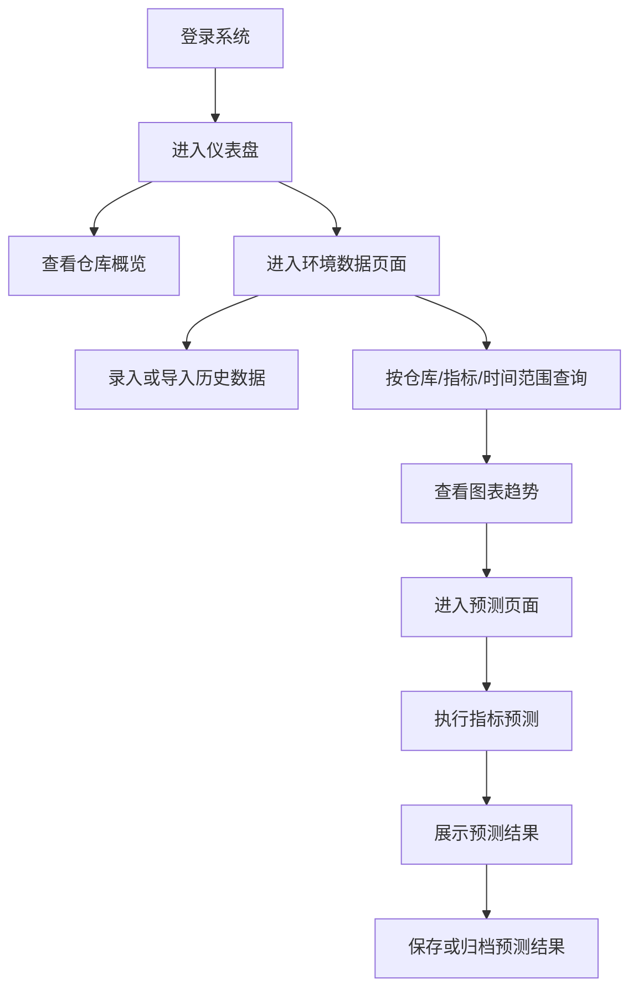
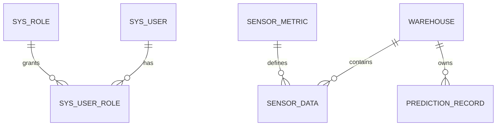

# 开发指导版 PRD

## 粮仓环境数据预测管理平台

> 2026-04-08 重要更新：
> - 预测主线已不再以“24 小时短期多指标预测展示”为主。
> - 当前正式口径调整为“粮温数据导入 + 汇总分析 + 8 个月训练参考 + 2 个月按天滚动预测 + 真实值回填验证 + 修正续预测 + 高温预警闭环”。
> - 湿度、二氧化碳仍保留为普通环境数据管理，但当前预测与数据库设计重点已明确转向粮温闭环。
> - 如本文与以下新文档冲突，以新文档为准：
>   - `zzz-docs/设计文档/粮仓环境数据预测管理平台-PRD-滚动预测闭环版.md`
>   - `zzz-docs/设计文档/数据库设计-滚动预测与高温预警版.md`
>   - `zzz-docs/设计文档/滚动预测改造-字段与接口变更方案.md`

> 文档定位：这是一份可直接指导后续开发的 PRD。  
> 真相源基础：
> - [2.任务书.md](D:\Users\Mobius\Desktop\mine\AAA-code\bs-test-01\zzz-docs\2.任务书.md)
> - [开题报告.md](D:\Users\Mobius\Desktop\mine\AAA-code\bs-test-01\zzz-docs\开题报告.md)
> - [需求清单-任务书与开题报告对齐.md](D:\Users\Mobius\Desktop\mine\AAA-code\bs-test-01\zzz-docs\需求清单-任务书与开题报告对齐.md)

## 1. 文档目的

本文档用于统一以下内容：

- 项目最终要做什么
- 什么是本次毕设的范围内内容
- 前端需要做什么
- 后端需要做什么
- 数据库应该如何设计
- 开发顺序和阶段目标是什么
- 后续实现时如何按文档拆任务推进

换句话说，这份文档不是“介绍项目”，而是“后续开发总蓝图”。

## 2. 项目概述

### 2.1 项目名称

粮仓环境数据预测管理平台

### 2.2 项目背景

传统粮仓管理方式主要依赖人工巡检和经验判断，存在以下问题：

- 环境数据分散，难以统一管理
- 历史数据追溯能力弱
- 仅看实时数据，难以提前发现温度上升等风险
- 管理流程缺少平台化、数据化支撑

因此，本项目拟建设一个面向粮仓场景的环境数据预测管理平台，实现从粮温报表导入、原始测点数据入库、汇总分析、滚动预测、误差验证、修正续预测到高温预警的一体化管理。

### 2.3 项目一句话定义

这是一个面向粮仓场景的前后端分离管理平台，用于管理粮温与环境数据、展示历史趋势，并以粮温为核心完成滚动预测、验证修正和高温预警闭环，辅助管理人员做出基本决策。

## 3. 项目目标

### 3.1 总目标

完成一个可运行、可演示、可提交代码和说明书的粮仓环境数据预测管理平台。

### 3.2 分目标

1. 建立规范的粮仓环境数据管理能力
2. 支持固定模板粮温 XLS 导入、原始测点入库和汇总分析
3. 支持图表化展示环境变化趋势与粮温分析结果
4. 支持基于历史真实粮温数据的滚动预测、验证与修正
5. 支持预测结果展示、归档和高温预警
6. 完成前后端分离系统实现
7. 形成毕业设计说明书、过程文档和系统代码

## 4. 范围边界

### 4.1 范围内

- 用户登录与角色区分
- 用户管理
- 仓库信息管理
- 环境数据导入或录入
- 环境数据查询
- 图表展示
- 粮温滚动预测闭环
- 预测结果展示、误差验证与修正归档
- 真实高温预警与预测高温预警
- 可运行 Web 系统

### 4.2 范围外

- 真实物联网硬件接入
- LoRa / 5G / GSM 通信层实现
- 巡检机器人
- 数字孪生
- 区块链
- 复杂深度学习预测模型
- 生产级运维与部署平台

## 5. 成功标准

项目完成时，至少满足以下标准：

1. 系统可正常启动并展示完整业务流程
2. 用户可登录并进入系统首页
3. 用户可查看和维护仓库信息
4. 用户可录入或导入环境数据
5. 用户可按条件查询环境数据
6. 用户可查看图表展示的历史趋势
7. 用户可获取滚动预测结果、误差验证结果与高温预警结果
8. 系统具有完整代码、数据库设计和说明文档
9. 系统适合毕业答辩演示

## 6. 默认技术路线

基于任务书和开题报告对齐后，正式实现建议使用：

### 前端

- Vue 3
- Vite
- Vue Router
- Pinia
- Element Plus
- ECharts
- Axios

### 后端

- Java 17
- Spring Boot
- MyBatis
- Spring Validation
- Lombok

### 数据库

- MySQL 8.x

### 开发工具

- IntelliJ IDEA 或 VS Code
- Navicat / DBeaver / MySQL Workbench
- Apifox / Postman
- Git

### 为什么不采用 Next 作为正式路线

- Next 是 React 生态框架，不适合直接写 Vue
- 本项目不需要 SSR 和复杂的全栈渲染能力
- Vue 更贴合开题报告正文路线
- Vue + Vite 更适合后台管理系统快速落地

## 7. 用户角色设计

### 7.1 管理员 ADMIN

职责：

- 管理系统用户
- 管理仓库信息
- 查看全部环境数据
- 查看全部预测结果

### 7.2 仓库管理员 WAREHOUSE_MANAGER

职责：

- 查看所属仓库环境数据
- 录入环境数据
- 查看预测结果

### 7.3 查看者 VIEWER

职责：

- 只读查看图表、统计、预测结果

## 8. 用户核心流程



## 9. 功能需求

## 9.1 登录与权限模块

### 功能说明

- 用户输入用户名密码登录
- 登录成功后进入首页
- 页面展示当前用户名称和角色
- 不同角色展示不同权限范围

### 页面

- 登录页

### 后端能力

- 登录接口
- 返回用户基础信息和角色

### 验收标准

- 可成功登录
- 可显示角色
- 未登录不能访问业务页面

## 9.2 仪表盘模块

### 功能说明

展示系统概览信息，帮助用户快速了解当前系统状态。

### 建议展示内容

- 粮仓总数
- 今日采样数据量
- 当前预警数量
- 最近一次预测摘要
- 最新环境数据列表

### 页面

- 仪表盘首页

### 后端能力

- 首页统计接口
- 最近记录接口

### 验收标准

- 首页能在一屏内展示核心信息
- 数据更新后首页可同步展示

## 9.3 用户管理模块

### 功能说明

- 管理员可查看用户列表
- 支持新增用户
- 支持分配角色
- 支持启用/禁用用户

### 页面

- 用户管理页

### 后端能力

- 用户列表接口
- 新增用户接口
- 更新用户接口
- 删除或禁用用户接口

### 验收标准

- 用户基础信息可维护
- 角色分配可生效

## 9.4 仓库管理模块

### 功能说明

- 维护粮仓基础信息
- 查询仓库列表
- 新增仓库
- 编辑仓库

### 字段建议

- 仓库编号
- 仓库名称
- 位置
- 容量
- 负责人
- 状态

### 页面

- 仓库管理页

### 后端能力

- 仓库分页列表接口
- 新增仓库接口
- 编辑仓库接口
- 删除仓库接口

### 验收标准

- 仓库信息可新增、编辑、查询
- 环境数据可正确关联到仓库

## 9.5 环境数据模块

### 功能说明

- 录入温度、湿度等数据
- 支持后续扩展更多指标
- 支持历史数据查询
- 支持表格展示与图表展示

### 数据字段

- 仓库 ID
- 指标类型
- 指标值
- 采集时间

### 页面

- 环境数据录入页
- 环境数据查询页

### 后端能力

- 数据新增接口
- 数据批量导入接口（可放 v1.1）
- 数据条件查询接口
- 图表数据接口

### 验收标准

- 能录入环境数据
- 能按条件查出数据
- 能正确显示历史趋势

## 9.6 多指标独立预测模块

### 功能说明

- 基于历史环境指标数据进行独立短期预测
- 支持用户选择仓库、指标和预测步数
- 输出预测值
- 展示预测结果

### 预测策略

正式实现建议先采用轻量算法：

- 简单线性回归
- 滑动平均
- 加权移动平均

先保证：

- 逻辑可解释
- 数据流程完整
- 页面可展示

### 页面

- 指标预测页

### 后端能力

- 读取历史指标数据
- 按所选 `metricCode` 执行独立预测算法
- 返回预测结果
- 保存预测记录

### 验收标准

- 能输出未来若干时间点预测值
- 样本不足时给出提示
- 页面可用表格或图表展示结果

## 9.7 预测结果归档模块

### 功能说明

- 将预测结果写入数据库
- 支持后续查看历史预测记录

### 页面

- 可合并在预测页中
- 可选单独提供预测记录页

### 后端能力

- 保存预测记录接口
- 查询预测记录接口

### 验收标准

- 预测结果可保存
- 可按仓库和时间查询预测记录

## 10. 前端设计

## 10.1 前端目录建议

```text
frontend/
├── src/
│   ├── api/
│   ├── assets/
│   ├── components/
│   ├── layout/
│   ├── router/
│   ├── stores/
│   ├── utils/
│   ├── views/
│   ├── App.vue
│   └── main.ts
```

## 10.2 页面结构建议

### 页面清单

1. 登录页
2. 仪表盘页
3. 用户管理页
4. 仓库管理页
5. 环境数据录入页
6. 环境数据查询页
7. 温度预测页

### 布局结构

- 左侧菜单
- 顶部用户区
- 主内容区域

## 10.3 前端组件建议

可复用组件包括：

- 页面头部组件
- 条件筛选组件
- 数据表格组件
- 图表卡片组件
- 统计卡片组件
- 表单弹窗组件

## 10.4 状态管理建议

使用 Pinia 管理：

- 当前登录用户
- 当前角色
- 菜单状态
- 全局筛选条件

业务数据尽量页面内请求，避免过度全局化。

## 10.5 图表设计建议

ECharts 推荐使用：

- 折线图：展示温度/湿度历史变化
- 柱状图：展示统计对比
- 卡片图：展示关键指标

## 10.6 前端页面交互原则

- 表单尽量简洁
- 查询条件不过多堆叠
- 图表和表格同时出现时，先图后表
- 页面先保证信息清晰，再考虑视觉增强

## 11. 后端设计

## 11.1 后端目录建议

```text
backend/
├── src/main/java/com/grain/platform/
│   ├── config/
│   ├── controller/
│   ├── service/
│   ├── service/impl/
│   ├── mapper/
│   ├── entity/
│   ├── dto/
│   ├── vo/
│   ├── common/
│   └── util/
```

## 11.2 分层设计

### Controller 层

负责：

- 接收前端请求
- 参数校验
- 返回统一响应结果

### Service 层

负责：

- 核心业务逻辑
- 数据查询与处理
- 预测逻辑调用

### Mapper 层

负责：

- 与数据库交互
- 使用 MyBatis 编写 SQL

### Entity / DTO / VO

- Entity：数据库表映射
- DTO：请求参数对象
- VO：响应展示对象

## 11.3 后端核心模块

建议至少包含：

- AuthController / AuthService
- UserController / UserService
- WarehouseController / WarehouseService
- SensorDataController / SensorDataService
- PredictionController / PredictionService
- DashboardController / DashboardService

## 11.4 统一返回结构建议

```json
{
  "code": 200,
  "message": "success",
  "data": {}
}
```

错误时：

```json
{
  "code": 500,
  "message": "error message",
  "data": null
}
```

## 11.5 登录与权限建议

毕业设计阶段可分两层：

### MVP

- 账号密码登录
- Session 或简单 Token
- 页面级角色区分

### 可增强

- JWT
- 接口权限注解

如果时间紧，优先保证登录流程完整，不必一开始做复杂权限。

## 12. 数据库设计

## 12.1 表设计清单

建议最少 7 张表：

1. `sys_user`
2. `sys_role`
3. `sys_user_role`
4. `warehouse`
5. `sensor_metric`
6. `sensor_data`
7. `prediction_record`

## 12.2 核心表字段建议

### sys_user

- id
- username
- password
- display_name
- status
- created_at

### sys_role

- id
- role_code
- role_name

### warehouse

- id
- warehouse_code
- warehouse_name
- location
- capacity_ton
- manager_name
- status
- created_at

### sensor_metric

- id
- metric_code
- metric_name
- unit

### sensor_data

- id
- warehouse_id
- metric_code
- metric_value
- collected_at
- created_at

### prediction_record

- id
- warehouse_id
- metric_code
- algorithm_name
- predicted_time
- predicted_value
- created_at

## 12.3 数据库关系示意



## 13. 接口设计

## 13.1 登录接口

### POST /api/auth/login

请求体：

```json
{
  "username": "admin",
  "password": "123456"
}
```

返回：

```json
{
  "code": 200,
  "message": "success",
  "data": {
    "userId": 1,
    "username": "admin",
    "displayName": "管理员",
    "role": "ADMIN",
    "token": "demo-token"
  }
}
```

## 13.2 首页概览接口

### GET /api/dashboard/overview

返回：

- 粮仓数量
- 今日采样量
- 预警数量
- 最新预警列表

## 13.3 用户接口

- `GET /api/users`
- `POST /api/users`
- `PUT /api/users/{id}`
- `DELETE /api/users/{id}`

## 13.4 仓库接口

- `GET /api/warehouses`
- `POST /api/warehouses`
- `PUT /api/warehouses/{id}`
- `DELETE /api/warehouses/{id}`

## 13.5 环境数据接口

- `GET /api/sensor-data`
- `POST /api/sensor-data`
- `POST /api/sensor-data/import`（可选）

查询参数建议：

- warehouseId
- metricType
- startTime
- endTime

## 13.6 预测接口

### POST /api/predictions

请求体：

```json
{
  "warehouseId": 1,
  "metricCode": "temperature",
  "futureSteps": 6
}
```

返回：

```json
{
  "code": 200,
  "message": "success",
  "data": [
    {
      "time": "2026-04-06 13:00:00",
      "actualValue": null,
      "predictedValue": 25.7
    }
  ]
}
```

## 14. 开发过程与阶段计划

## 14.1 阶段一：需求与设计

目标：

- 完成文档对齐
- 确认功能范围
- 确认技术栈
- 确认数据库结构

产出：

- 需求清单
- 开发指导版 PRD
- 页面清单
- 接口清单
- 数据库设计

## 14.2 阶段二：前端原型

目标：

- 做出静态页面雏形
- 确认页面结构
- 确认交互流程

产出：

- 登录页
- 仪表盘页
- 仓库管理页
- 数据页
- 预测页

## 14.3 阶段三：后端基础开发

目标：

- 建立 Spring Boot 工程
- 建立数据库
- 编写基础接口

产出：

- 登录接口
- 仓库接口
- 环境数据接口
- 预测接口

## 14.4 阶段四：联调

目标：

- 前后端联调
- 图表展示数据打通
- 预测流程打通

产出：

- 可跑通的业务流程
- 可展示的预测结果

## 14.5 阶段五：测试与收尾

目标：

- 完成功能测试
- 完善说明书
- 准备答辩材料

产出：

- 测试截图
- 系统说明书
- 毕设 PPT

## 15. 开发优先级

优先级建议如下：

### P0 必做

- 登录
- 仪表盘
- 仓库管理
- 环境数据录入与查询
- 图表展示
- 多指标独立预测

### P1 可增强

- 数据导入
- 预测结果归档页面
- 更丰富的预警提示

### P2 有时间再做

- 权限细化
- 批量导入
- 更复杂算法

## 16. 测试要求

### 前端测试

- 页面可正常跳转
- 表单可正常提交
- 图表可正常渲染

### 后端测试

- 接口返回结构统一
- 查询条件生效
- 预测结果可正常返回

### 联调测试

- 登录 -> 首页 -> 查询数据 -> 预测结果 全流程可走通

## 17. 风险与应对

### 风险 1：范围失控

应对：

- 严格按本文档范围开发
- 不主动扩展到硬件和复杂 AI

### 风险 2：后端功能过多

应对：

- 先做 P0
- 保证完整流程优先

### 风险 3：前后端联调时间不够

应对：

- 前端早期用 mock
- 后端接口优先打核心路径

### 风险 4：预测算法复杂度过高

应对：

- 优先使用简单线性回归或滑动平均

## 18. 验收标准

毕业设计阶段，系统完成可认为满足以下条件：

1. 前后端都可运行
2. 数据库可正常存储业务数据
3. 用户可登录进入系统
4. 仓库信息可管理
5. 环境数据可录入和查询
6. 图表可展示历史数据
7. 多指标预测可产生结果
8. 说明书和代码齐全
9. 系统适合演示答辩

## 19. 本文档如何指导后续开发

后续开发默认按以下顺序执行：

1. 先按本文档确定数据库
2. 再按本文档确定接口
3. 再按本文档完成前端页面
4. 然后完成联调
5. 最后补测试和文档

如果后续你让我继续开发，我将默认以本文档作为实现依据，优先完成：

- 数据库 SQL
- 后端接口骨架
- Vue 前端页面骨架
- 前后端联调主流程

## 20. 最终结论

这个毕设最稳妥的做法不是追求“大而全”，而是完成一个：

**可登录、可管理、可查询、可展示、可预测、可演示的粮仓环境数据预测管理平台**

这就是本项目的正式开发目标。
