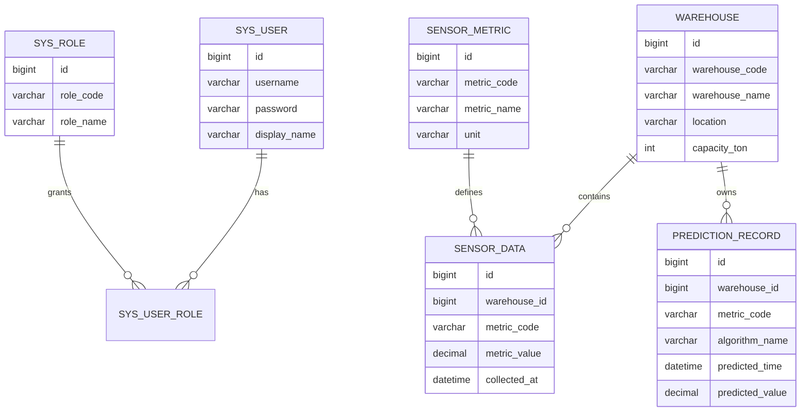

# 粮仓环境数据预测管理平台阶段汇报

## 产品设计与编程工作交流

- 时间：2026年4月5日 19:00
- 地点：科创中心 407-3 会议室
- 项目题目：基于 Spring Boot 的粮仓环境数据预测管理平台设计与实现

---

## 1. 近阶段主要工作

- 阅读并整理任务书、开题报告
- 对项目需求进行拆解和范围收敛
- 明确前后端技术路线
- 初步完成数据库设计思路
- 编写前端首页静态页面雏形
- 搭建项目基础结构并做页面预览

---

## 2. 当前对项目的理解

本项目最终目标不是做一个复杂的硬件系统，而是做一个面向粮仓场景的管理平台。

目前聚焦的核心能力有：

- 粮仓基础信息管理
- 环境数据录入与查询
- 历史数据图表展示
- 温度趋势预测
- 预测结果展示与归档

---

## 3. 当前阶段成果概览

### 已完成

- 需求分析与文档整理
- 技术栈选择
- 数据库表设计初稿
- 前端首页静态页面雏形

### 正在推进

- 详情页与数据页设计
- 接口设计细化
- 预测模块逻辑整理

### 下一步

- 完善前端各功能页面
- 开发后端接口
- 接入数据库与联调

---

## 4. 技术栈选择

### 前端

- Vue
- ECharts
- Ant Design Vue 或基础组件方案

### 后端

- Spring Boot
- MyBatis

### 数据库

- MySQL

### 预测思路

- 简单线性回归
- 滑动平均或加权移动平均

---

## 5. 为什么这样选型

- Vue 上手更直接，写页面和状态管理时比 React 更顺手
- Spring Boot 对 Web 项目非常友好，开发效率高
- MyBatis 对 SQL 的控制感更强，写查询时更清晰
- JPA 虽然方便，但在复杂表设计和查询上感觉有点绕，不如 MyBatis 直观
- MySQL 成熟稳定，适合毕业设计场景

---

## 6. 数据库设计思路

当前已经想好的核心表有：

- `sys_user`：用户表
- `sys_role`：角色表
- `sys_user_role`：用户角色关联表
- `warehouse`：粮仓信息表
- `sensor_metric`：指标类型表
- `sensor_data`：环境数据表
- `prediction_record`：预测结果表

---

## 7. 数据库结构示意

---

## 8. 前端页面规划

计划页面包括：

- 登录页
- 首页仪表盘
- 仓库管理页
- 环境数据录入页
- 环境数据查询页
- 温度预测结果页

当前已经写了一个大致的首页静态页面，用来先看整体风格和信息布局。

---

## 9. 首页静态页面雏形

首页目前重点展示：

- 粮仓数量
- 今日采样量
- 预警信息
- 近期预测摘要
- 最近数据记录

截图占位：

`[截图占位：首页静态页面预览]`

---

## 10. 首页设计思路

- 风格尽量简洁，不追求复杂视觉效果
- 先把“能看什么信息”摆清楚
- 信息优先级上，先展示总览，再展示重点预警和预测结果
- 页面结构上，尽量让老师一眼看到“这是个管理平台”

---

## 11. 前后端职责划分

### 前端负责

- 页面展示
- 用户交互
- 筛选条件输入
- 图表渲染
- 预测结果展示

### 后端负责

- 用户登录
- 仓库信息管理
- 环境数据管理
- 查询接口
- 预测逻辑
- 数据库存储与返回

---

## 12. 当前编程体会

### Vue

- 语法更直观
- 页面开发节奏更快
- 对这类管理系统更友好

### React

- 更灵活
- 但前期搭页面时需要考虑的东西更多
- 对当前这个项目来说，Vue 体感更轻松一些

---

## 13. 当前编程体会

### Spring Boot

- 项目搭建方便
- 接口开发效率高
- 配置和启动都比较顺手

### MyBatis

- SQL 可控性强
- 对数据库设计和查询更友好
- 便于后续按业务写接口

### JPA

- 简单场景确实省事
- 但一旦表关系和查询复杂起来，感觉不如 MyBatis 清晰

---

## 14. 目前遇到的问题

- 需求边界容易被“智能粮仓”这个大背景带偏
- 文献里提到的技术很多，但真正实现范围需要收敛
- 前端页面能很快出雏形，但后端设计要考虑后续扩展
- 预测模块需要在“简单可实现”和“有一定效果”之间平衡

---

## 15. 我的解决思路

- 先把系统范围收敛成“管理平台”
- 先做完整流程，再考虑功能增强
- 先做轻量级预测，再考虑更复杂算法
- 先让页面和数据库结构稳定下来，再做联调

---

## 16. 下一阶段计划

- 完善前端页面结构
- 完成后端接口设计
- 建立数据库并导入模拟数据
- 完成环境数据查询功能
- 实现温度预测结果展示
- 开始前后端联调

---

## 17. 阶段总结

这一阶段最大的收获是：

- 对项目真正要做什么更清楚了
- 技术路线已经基本确定
- 数据库和页面雏形已经有了方向
- 对后续开发流程有了更明确的安排

目前虽然还处在早期阶段，但系统的整体框架已经开始成形。

---

## 18. 致谢

感谢老师和同学们的指导与交流。

欢迎提出建议。
