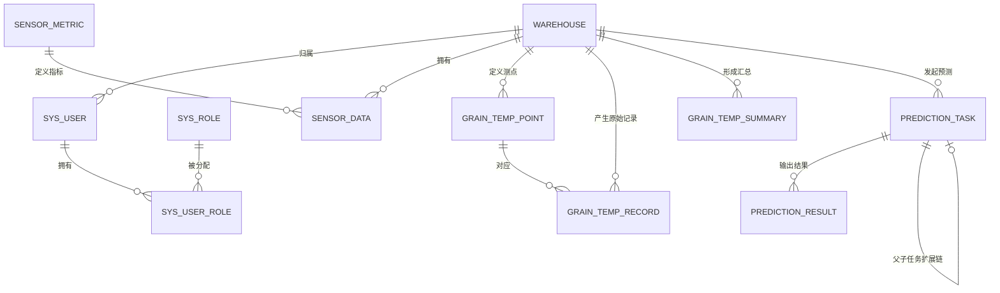

# 数据库设计（数据库优先 MVP / 与当前 schema.sql 对齐版）

## 1. 文档目的

本文档用于说明当前系统的数据库设计，并服务于：

- 论文数据库章节写作
- 答辩中的数据模型说明
- 后续接口与页面联调

本版已按 **2026-04-11** 的 `backend/src/main/resources/db/schema.sql` 核对。

真相源优先级：

1. `backend/src/main/resources/db/schema.sql`
2. `.planning/REQUIREMENTS.md` / `ROADMAP.md`
3. `.devflow/grain-platform-bootstrap/state.md`

## 2. 设计原则

### 2.1 数据保存优先

数据库首先服务于“保存、管理、追溯、归档”，而不是为复杂算法炫技。

因此本期优先保证：

- 原始数据可落库
- 汇总结果可落库
- 预测任务和结果可落库
- 所有关键数据可按仓库、时间和指标查询

### 2.2 真实数据与预测数据分离

真实数据与预测数据语义不同，必须分表：

- 真实数据用于事实记录、汇总分析和真实预警
- 预测数据用于任务归档、结果展示和预测预警

### 2.3 粮温与普通环境数据分层建模

- 粮温来源于测点矩阵，结构复杂，采用深建模
- 湿度、二氧化碳是单值时序，采用轻建模

这样既能体现数据库设计深度，又能控制实现复杂度。

### 2.4 归档直接建立在业务表之上

当前归档能力直接由以下两张表承担：

- `prediction_task`
- `prediction_result`

本期不再新增独立 archive 表，避免：

- 数据冗余
- 一致性成本
- 额外实现负担

### 2.5 扩展字段保留，但不强制启用

数据库中继续保留以下扩展字段：

- `parent_task_id`
- `task_round`
- `based_on_actual_end_time`
- `trigger_type`
- `adjust_status`
- `actual_value`
- `error_value`
- `error_rate`
- `is_corrected`

这些字段用于说明系统具备扩展空间，但不代表当前必须实现修正预测入口。

## 3. 业务域拆分

当前数据库可按 5 个业务域理解：

1. 仓库域
2. 用户与权限域
3. 普通环境数据域
4. 粮温数据域
5. 预测与预警域

## 4. 核心表清单

| 表名 | 中文名称 | 本期定位 |
| --- | --- | --- |
| `warehouse` | 仓库表 | 主档表 |
| `sys_role` | 角色表 | 权限基础表 |
| `sys_user` | 用户表 | 账户主表 |
| `sys_user_role` | 用户角色关联表 | 多角色关联表 |
| `sensor_metric` | 指标字典表 | 环境指标配置表 |
| `sensor_data` | 普通环境数据表 | 湿度 / 二氧化碳主表 |
| `grain_temp_point` | 粮温测点定义表 | 粮温结构基础表 |
| `grain_temp_record` | 粮温原始记录表 | 粮温真实数据表 |
| `grain_temp_summary` | 粮温汇总分析表 | 粮温展示与预测输入表 |
| `prediction_task` | 预测任务表 | 预测归档主表 |
| `prediction_result` | 预测结果表 | 预测归档明细表 |

## 5. 各表设计说明

### 5.1 `warehouse`

作用：

- 保存仓库基础档案
- 为用户、粮温数据、普通环境数据和预测任务提供归属主体

主要字段：

- `warehouse_code`
- `warehouse_name`
- `location`
- `capacity_ton`
- `manager_name`
- `contact_phone`
- `status`
- `grain_type`
- `remark`

约束与索引：

- 唯一键：`uk_warehouse_code (warehouse_code)`
- 索引：`idx_warehouse_status (status)`

### 5.2 `sys_role`

作用：

- 定义系统角色
- 为用户多角色维护提供标准选项

主要字段：

- `role_code`
- `role_name`
- `role_desc`

约束：

- 唯一键：`uk_role_code (role_code)`

### 5.3 `sys_user`

作用：

- 保存登录账号和展示信息
- 允许与仓库建立归属关系

主要字段：

- `username`
- `password`
- `display_name`
- `phone`
- `warehouse_id`
- `status`
- `last_login_at`

约束与索引：

- 唯一键：`uk_username (username)`
- 索引：`idx_user_status`、`idx_user_warehouse`
- 外键：`warehouse_id -> warehouse.id`

### 5.4 `sys_user_role`

作用：

- 支撑一个用户对应多个角色

主要字段：

- `user_id`
- `role_id`

约束：

- 唯一键：`uk_user_role (user_id, role_id)`
- 外键：`user_id -> sys_user.id`，`role_id -> sys_role.id`

### 5.5 `sensor_metric`

作用：

- 管理温度、湿度、二氧化碳等指标定义
- 统一单位、阈值和启停状态

主要字段：

- `metric_code`
- `metric_name`
- `unit`
- `min_threshold`
- `max_threshold`
- `status`

约束：

- 唯一键：`uk_metric_code (metric_code)`

### 5.6 `sensor_data`

作用：

- 保存湿度、二氧化碳等普通环境数据
- 支持导入、手工录入、分页查询与趋势图

主要字段：

| 字段名 | 说明 |
| --- | --- |
| `warehouse_id` | 所属仓库 |
| `metric_code` | 指标编码 |
| `metric_value` | 指标值 |
| `collected_at` | 采集时间 |
| `source_type` | 来源：`MANUAL / IMPORT` |
| `source_batch_no` | 导入批次号 |
| `quality_flag` | 质量标记 |
| `remark` | 备注 |
| `created_by` | 操作人 |

索引：

- `idx_sensor_query (warehouse_id, metric_code, collected_at)`
- `idx_sensor_batch (source_batch_no)`
- `idx_sensor_created_by (created_by)`

### 5.7 `grain_temp_point`

作用：

- 描述粮温测点结构
- 将仓库、区域、层号、点位与测温缆建立关联

主要字段：

- `warehouse_id`
- `probe_code`
- `zone_code`
- `layer_no`
- `point_no`
- `point_name`
- `status`
- `remark`

约束：

- 唯一键：`uk_grain_temp_point (warehouse_id, zone_code, layer_no, point_no)`
- 索引：`idx_grain_temp_point_probe (warehouse_id, probe_code)`

### 5.8 `grain_temp_record`

作用：

- 保存每次采集或导入得到的原始测点温度
- 为粮温汇总、图表和预警提供事实来源

主要字段：

| 字段名 | 说明 |
| --- | --- |
| `warehouse_id` | 所属仓库 |
| `point_id` | 测点 ID |
| `collected_at` | 检测时间 |
| `temperature_value` | 温度值 |
| `source_type` | 来源：`IMPORT / MANUAL` |
| `batch_no` | 导入批次号 |
| `quality_flag` | 质量标记 |
| `remark` | 备注 |
| `created_by` | 录入人 |

约束与索引：

- 唯一键：`uk_grain_temp_record_point_time (point_id, collected_at)`
- 索引：`idx_grain_temp_record_query (warehouse_id, collected_at)`

### 5.9 `grain_temp_summary`

作用：

- 保存系统自动计算的层均温与整仓汇总结果
- 作为图表展示和预测输入主表
- 输出真实高温预警

主要字段：

| 字段名 | 说明 |
| --- | --- |
| `warehouse_id` | 所属仓库 |
| `collected_at` | 汇总时间 |
| `avg_temp` | 整仓均温 |
| `max_temp` | 最高温 |
| `min_temp` | 最低温 |
| `layer_1_avg` ~ `layer_4_avg` | 各层均温 |
| `warning_level` | 真实预警等级 |
| `warning_flag` | 是否预警 |
| `warning_message` | 预警说明 |
| `analysis_result` | 分析结果 |
| `analysis_remark` | 分析备注 |

约束与索引：

- 唯一键：`uk_grain_temp_summary_time (warehouse_id, collected_at)`
- 索引：`idx_grain_temp_summary_query (warehouse_id, collected_at)`

### 5.10 `prediction_task`

作用：

- 保存一次预测请求的完整上下文
- 承担预测任务级归档能力

本期核心字段：

| 字段名 | 说明 |
| --- | --- |
| `task_no` | 任务编号 |
| `warehouse_id` | 所属仓库 |
| `metric_code` | 预测指标 |
| `data_source_type` | 数据来源类型 |
| `target_type` | 预测目标 |
| `algorithm_code` | 算法编码 |
| `algorithm_name` | 算法名称 |
| `train_start_time` | 训练开始时间 |
| `train_end_time` | 训练结束时间 |
| `forecast_start_time` | 预测开始时间 |
| `forecast_end_time` | 预测结束时间 |
| `forecast_days` | 预测天数 |
| `sample_size` | 样本数 |
| `status` | 任务状态 |
| `risk_level` | 风险等级 |
| `requested_by` | 发起人 |
| `requested_at` | 发起时间 |
| `completed_at` | 完成时间 |
| `summary` | 任务摘要 |
| `remark` | 备注 |

扩展字段：

- `parent_task_id`
- `task_round`
- `based_on_actual_end_time`
- `trigger_type`
- `adjust_status`

约束与索引：

- 唯一键：`uk_prediction_task_no (task_no)`
- 索引：`idx_prediction_task_query (warehouse_id, metric_code, requested_at)`
- 索引：`idx_prediction_task_parent (parent_task_id)`

### 5.11 `prediction_result`

作用：

- 保存某轮预测任务下的结果明细
- 支撑预测记录表、摘要、双线图和预测预警

本期核心字段：

| 字段名 | 说明 |
| --- | --- |
| `task_id` | 所属任务 |
| `phase_type` | 结果阶段：`VERIFY / FUTURE` |
| `step_index` | 结果序号 |
| `result_time` | 结果时间 |
| `actual_value` | 真实值 |
| `predicted_value` | 预测值 |
| `error_value` | 误差值 |
| `error_rate` | 误差率 |
| `warning_level` | 预测预警等级 |
| `warning_flag` | 是否预警 |
| `warning_message` | 预警说明 |
| `is_corrected` | 是否修正结果 |
| `remark` | 备注 |

约束与索引：

- 唯一键：`uk_prediction_result_task_time (task_id, result_time)`
- 索引：`idx_prediction_result_time (result_time)`

## 6. 实体关系说明

## 7. 本期核心数据链路

### 7.1 粮温导入链路

### 7.2 普通环境数据链路

### 7.3 预测与归档链路

## 8. 索引与查询设计

### 8.1 当前索引设计重点

- `sensor_data`：按仓库 + 指标 + 时间查询
- `grain_temp_record`：按仓库 + 时间查询原始测点，按点位 + 时间保证唯一
- `grain_temp_summary`：按仓库 + 时间查询汇总趋势
- `prediction_task`：按仓库 + 指标 + 时间回看预测任务
- `prediction_result`：按任务 + 时间读取结果详情

### 8.2 对页面的支撑关系

| 页面 / 模块 | 主要依赖表 |
| --- | --- |
| 用户页 | `sys_user`、`sys_role`、`sys_user_role` |
| 仓库页 | `warehouse` |
| 数据页-普通环境 | `sensor_metric`、`sensor_data` |
| 数据页-粮温原始记录 | `grain_temp_point`、`grain_temp_record` |
| 数据页-粮温汇总 | `grain_temp_summary` |
| 预测页 | `grain_temp_summary`、`prediction_task`、`prediction_result` |
| 仪表盘 / 大屏 | `warehouse`、`grain_temp_summary`、`prediction_task`、`prediction_result` |

## 9. 预警设计

### 9.1 真实预警

来源：

- `grain_temp_summary.warning_level`
- `grain_temp_summary.warning_flag`
- `grain_temp_summary.warning_message`

作用：

- 判断当前真实粮温是否存在高温风险

### 9.2 预测预警

来源：

- `prediction_result.warning_level`
- `prediction_result.warning_flag`
- `prediction_result.warning_message`

作用：

- 判断未来某一天是否存在温度风险

### 9.3 当前预警等级

- `NORMAL`
- `ATTENTION`
- `WARNING`

## 10. 与代码核对结果

2026-04-11 对照 `schema.sql`、Controller 与现有设计文档后的结论如下：

1. **数据库主结构无新增偏差**：当前系统确实以 11 张核心表支撑主链，数据库设计文档与代码没有表级冲突。
2. **主要差异在文档口径滞后**：旧文档对分页、大屏、预测删除等功能描述不足，而不是数据库结构没跟上。
3. **修正链字段仍存在，但属于扩展预留**：数据库允许表达父子任务、误差与修正结果，但当前主线并未把它作为必做入口。

## 11. 最终结论

当前数据库设计的核心价值不在于“修正链做得多完整”，而在于：

- 原始数据结构是否清晰
- 数据是否能够长期保存
- 查询、筛选和管理是否方便
- 预测任务与结果是否能直接归档
- 是否能支撑页面、图表与答辩展示

因此，本期数据库设计的最终结论是：

**粮温主线深建模、普通环境数据轻建模、预测归档两层表、不拆独立 archive 表、保留扩展字段但不强制启用。**
