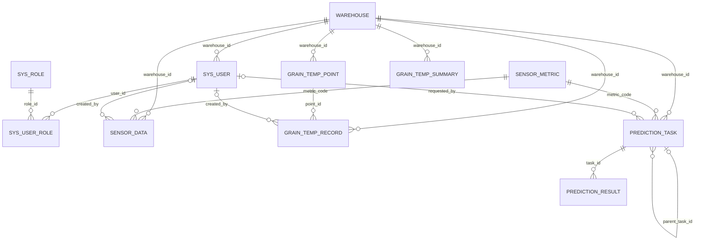

# 数据库设计讲解（论文版）

## 1. 文档说明

本文档用于把本项目的数据库设计讲清楚，重点回答以下问题：

- 数据库为什么这样拆表
- 各张表分别解决什么业务问题
- 主键、外键、唯一键和索引为什么这样设计
- 实体之间是什么关系
- 哪些地方是规范化设计，哪些地方是为了系统实现做的工程化取舍

本文档的整理依据来自以下仓库内文件：

1. `zzz-docs/设计文档/数据库设计-滚动预测与高温预警版.md`
2. `zzz-docs/写论文用/数据库设计-滚动预测与高温预警版.md`
3. `zzz-docs/写论文用/schema.sql`
4. `backend/src/main/resources/db/schema.sql`

说明：

- 前 3 项主要提供论文写作口径与现有设计说明。
- 第 4 项是当前系统真正执行的数据库结构真相源。
- 基于仓库文件内容对比可知，`zzz-docs/写论文用/schema.sql` 在测试数据部分比后端真实 `schema.sql` 更旧，因此本文的字段、约束、主外键关系以 `backend/src/main/resources/db/schema.sql` 为准；这是基于仓库内容得出的归纳结论。

## 2. 数据库设计目标

本系统的数据库不是单纯为了“存几张表”，而是为了支撑粮仓环境数据预测管理平台的完整业务链。具体目标如下：

1. 保存仓库、用户、角色等基础主数据。
2. 保存湿度、二氧化碳等普通环境监测数据。
3. 保存粮温测点、测点原始记录和汇总分析结果。
4. 保存预测任务及预测结果，形成可追溯的预测归档。
5. 支撑页面查询、趋势图展示、预警分析和论文答辩说明。

因此，这套数据库的核心思路可以概括为：

**主数据独立、真实数据与预测数据分离、复杂粮温深建模、普通环境数据轻建模、预测过程可追溯。**

## 3. 为什么选择关系型数据库

本系统选用 MySQL 进行关系型建模，主要原因如下：

1. 粮仓管理场景中，仓库、用户、测点、任务、结果之间存在清晰的主从和关联关系，适合用主键与外键表达。
2. 论文设计章节需要明确展示实体、关系、表结构和约束，关系型数据库更容易论证设计合理性。
3. 环境数据和预测结果需要支持按仓库、指标、时间范围查询，关系型数据库在结构化查询方面更直接。
4. 业务系统更关注“可管理、可追溯、可解释”，而不是超大规模分布式吞吐，MySQL 足以满足当前课题范围。

## 4. 总体设计思想

### 4.1 主数据先行

`warehouse`、`sys_user`、`sys_role`、`sys_user_role` 构成了系统的主数据和权限基础。没有这些主表，后续数据无法知道“属于哪个仓库、由谁录入、谁可以查看”。

### 4.2 普通环境数据和粮温数据分开建模

这是本设计最关键的拆分之一。

- 普通环境数据如湿度、二氧化碳，本质上是“某一时刻的单值指标”，适合用 `sensor_data` 做轻量时序表。
- 粮温数据来自多个测点，具有“仓库-区域-层号-点位-时间-温度值”的多维结构，如果仍然按单表简单存储，会丢失测点空间语义，因此必须拆成 `grain_temp_point`、`grain_temp_record`、`grain_temp_summary` 三层。

### 4.3 真实数据和预测数据分开保存

真实监测数据与模型预测结果不能混在一张表中，原因如下：

1. 二者语义不同。真实数据表示客观事实，预测数据表示模型输出。
2. 二者用途不同。真实数据用于回溯与实时预警，预测数据用于归档、展示和风险预判。
3. 混表会导致字段含义模糊，例如真实值、预测值、误差值、预警级别的含义会混乱。

因此系统把预测部分拆为：

- `prediction_task`：保存一次预测任务的上下文
- `prediction_result`：保存任务下的每个时间点预测结果

### 4.4 汇总表不是冗余，而是工程化取舍

`grain_temp_summary` 看起来像从 `grain_temp_record` 计算出来的冗余表，但它仍然有存在价值：

1. 前端页面与大屏更常用“整仓均温、最高温、各层均温”而不是每个测点明细。
2. 预测模型当前以汇总后的温度序列作为输入，比直接从测点明细计算更简单。
3. 论文答辩通常更强调可展示、可分析、可解释，汇总表可以直接支撑图表和预警说明。

这属于有意识的反规范化设计，不是随意重复存储。

### 4.5 扩展字段保留，体现系统可扩展性

`prediction_task` 和 `prediction_result` 中保留了如 `parent_task_id`、`task_round`、`based_on_actual_end_time`、`actual_value`、`error_value`、`error_rate`、`is_corrected` 等字段。

这些字段的意义在于：

- 说明预测任务可以形成多轮滚动修正链；
- 说明系统支持对预测结果进行验证和误差分析；
- 即使当前界面没有完全展开所有功能，数据库层面已经预留了扩展能力。

## 5. 业务域划分

从业务上看，11 张核心表可以分为 5 个域：

| 业务域 | 相关表 | 设计目的 |
| --- | --- | --- |
| 仓库主数据域 | `warehouse` | 统一管理仓库档案，作为其他表的归属主体 |
| 用户权限域 | `sys_role`、`sys_user`、`sys_user_role` | 管理账号、角色与授权关系 |
| 普通环境数据域 | `sensor_metric`、`sensor_data` | 存储湿度、二氧化碳等单值环境指标 |
| 粮温数据域 | `grain_temp_point`、`grain_temp_record`、`grain_temp_summary` | 存储测点结构、原始粮温和汇总分析 |
| 预测归档域 | `prediction_task`、`prediction_result` | 存储预测任务上下文与结果明细 |

## 6. ER 图

## 7. 实体关系分析

### 7.1 仓库是全局核心实体

`warehouse` 是全库最重要的主实体，大量业务表都通过 `warehouse_id` 与它关联。这样设计的原因是：

1. 几乎所有数据都必须回答“属于哪个仓库”。
2. 后续按仓库筛选、统计、展示都需要统一入口。
3. 用户也可能绑定仓库，因此仓库自然成为数据权限边界的一部分。

### 7.2 用户与角色是多对多关系

`sys_user` 与 `sys_role` 之间不是一对一，而是通过 `sys_user_role` 构成多对多关系。原因是：

1. 一个用户可能同时具备多个角色。
2. 一个角色也可能被多个用户共享。
3. 通过中间表建模比在用户表里直接写角色字符串更规范，也更易扩展。

### 7.3 粮温测点与粮温记录是一对多关系

一个测点在不同时间会产生多条记录，所以 `grain_temp_point` 与 `grain_temp_record` 是一对多关系。这样设计可以把“空间位置定义”和“时间序列数据”拆开：

- `grain_temp_point` 负责回答“这个点在哪里”
- `grain_temp_record` 负责回答“这个点在某时刻测到多少温度”

### 7.4 预测任务与预测结果是一对多关系

一次预测任务会输出多个时间点结果，因此 `prediction_task` 与 `prediction_result` 是一对多关系。这种拆法比把所有字段塞进一张表更合理，因为：

1. 任务级信息只需要保存一次。
2. 结果级信息可以按时间点展开。
3. 后续如果删除、重算、回看某次任务，边界更清晰。

### 7.5 预测任务支持自关联

`prediction_task.parent_task_id` 指向 `prediction_task.id`，形成父子任务关系。这里体现的是“滚动预测”和“修正预测”的设计思想：

- 第一轮预测为父任务；
- 新真实数据回填后发起修正预测，可指向上一轮任务；
- 这样可以保留历史预测轨迹，而不是直接覆盖旧结果。

## 8. 主键、外键、唯一键设计原则

### 8.1 主键设计

所有核心表都采用 `id BIGINT AUTO_INCREMENT` 作为主键，原因如下：

1. 统一风格，便于后端 Java 实体和 MyBatis 映射。
2. 避免业务字段直接做主键带来的修改成本。
3. 数值型主键便于连接查询和扩展。

### 8.2 外键设计

系统为关键业务关系建立了外键，例如：

- `sys_user.warehouse_id -> warehouse.id`
- `sensor_data.metric_code -> sensor_metric.metric_code`
- `grain_temp_record.point_id -> grain_temp_point.id`
- `prediction_result.task_id -> prediction_task.id`

外键的价值在于：

1. 保证引用完整性，防止出现“孤儿数据”。
2. 明确表达实体之间的业务关系。
3. 让数据库设计本身就具备较好的可解释性。

### 8.3 唯一键设计

系统不仅有主键，还通过唯一键约束业务唯一性：

| 表 | 唯一键 | 设计原因 |
| --- | --- | --- |
| `warehouse` | `warehouse_code` | 仓库编号在业务上应唯一 |
| `sys_role` | `role_code` | 角色编码不能重复 |
| `sys_user` | `username` | 登录名必须唯一 |
| `sys_user_role` | `(user_id, role_id)` | 防止一个用户重复绑定同一角色 |
| `sensor_metric` | `metric_code` | 指标编码应唯一 |
| `grain_temp_point` | `(warehouse_id, zone_code, layer_no, point_no)` | 同一仓库内一个空间点位只能定义一次 |
| `grain_temp_record` | `(point_id, collected_at)` | 同一测点同一时刻只应有一条记录 |
| `grain_temp_summary` | `(warehouse_id, collected_at)` | 同一仓库同一时刻只应有一份汇总 |
| `prediction_task` | `task_no` | 预测任务编号应唯一 |
| `prediction_result` | `(task_id, result_time)` | 同一任务下同一时刻结果只能存在一条 |

## 9. 表结构设计说明

说明：

- `PK` 表示主键
- `FK` 表示外键
- `UQ` 表示唯一约束
- `NN` 表示非空

### 9.1 `warehouse` 仓库表

设计定位：保存仓库基础档案，是其他业务数据的归属主体。

| 字段 | 类型 | 键/约束 | 说明 |
| --- | --- | --- | --- |
| `id` | BIGINT | PK, NN | 仓库主键 |
| `warehouse_code` | VARCHAR(64) | UQ, NN | 仓库编号，业务唯一标识 |
| `warehouse_name` | VARCHAR(128) | NN | 仓库名称 |
| `location` | VARCHAR(255) | NN | 仓库位置 |
| `capacity_ton` | DECIMAL(10,2) | NN | 仓容，便于业务展示 |
| `manager_name` | VARCHAR(64) | NN | 负责人姓名 |
| `contact_phone` | VARCHAR(32) | NULL | 联系电话 |
| `status` | VARCHAR(32) | NN | 仓库状态 |
| `grain_type` | VARCHAR(64) | NULL | 主要粮食品类 |
| `remark` | VARCHAR(255) | NULL | 备注 |
| `created_at` | DATETIME | NN | 创建时间 |
| `updated_at` | DATETIME | NN | 更新时间 |

设计原因：

1. 把仓库信息集中成主档表，避免每张业务表重复存仓库名称与位置。
2. 使用 `warehouse_code` 作为业务唯一键，便于展示和导入识别。
3. `status` 支撑启用、预警、维护等管理状态。

### 9.2 `sys_role` 角色表

设计定位：定义系统中的角色类型。

| 字段 | 类型 | 键/约束 | 说明 |
| --- | --- | --- | --- |
| `id` | BIGINT | PK, NN | 角色主键 |
| `role_code` | VARCHAR(64) | UQ, NN | 角色编码 |
| `role_name` | VARCHAR(64) | NN | 角色名称 |
| `role_desc` | VARCHAR(255) | NULL | 角色说明 |
| `created_at` | DATETIME | NN | 创建时间 |
| `updated_at` | DATETIME | NN | 更新时间 |

设计原因：

1. 角色与用户分离，便于统一授权。
2. `role_code` 用作稳定编码，避免只靠中文名称识别角色。

### 9.3 `sys_user` 用户表

设计定位：保存登录账户及其归属信息。

| 字段 | 类型 | 键/约束 | 说明 |
| --- | --- | --- | --- |
| `id` | BIGINT | PK, NN | 用户主键 |
| `username` | VARCHAR(64) | UQ, NN | 登录用户名 |
| `password` | VARCHAR(128) | NN | 密码或密码摘要 |
| `display_name` | VARCHAR(64) | NN | 展示名称 |
| `phone` | VARCHAR(32) | NULL | 手机号 |
| `warehouse_id` | BIGINT | FK, NULL | 所属仓库，平台级账号可为空 |
| `status` | VARCHAR(32) | NN | 用户状态 |
| `last_login_at` | DATETIME | NULL | 最后登录时间 |
| `created_at` | DATETIME | NN | 创建时间 |
| `updated_at` | DATETIME | NN | 更新时间 |

设计原因：

1. 用户与仓库关联，形成数据归属和权限边界。
2. `warehouse_id` 可为空，说明系统支持平台级账号。
3. `last_login_at` 用于运维和账号管理。

### 9.4 `sys_user_role` 用户角色关联表

设计定位：实现用户与角色的多对多关系。

| 字段 | 类型 | 键/约束 | 说明 |
| --- | --- | --- | --- |
| `id` | BIGINT | PK, NN | 关联主键 |
| `user_id` | BIGINT | FK, NN | 用户 ID |
| `role_id` | BIGINT | FK, NN | 角色 ID |
| `created_at` | DATETIME | NN | 创建时间 |

设计原因：

1. 用中间表表达多对多关系，符合关系型设计规范。
2. `uk_user_role(user_id, role_id)` 防止重复授权。

### 9.5 `sensor_metric` 指标字典表

设计定位：定义普通环境指标。

| 字段 | 类型 | 键/约束 | 说明 |
| --- | --- | --- | --- |
| `id` | BIGINT | PK, NN | 指标主键 |
| `metric_code` | VARCHAR(64) | UQ, NN | 指标编码 |
| `metric_name` | VARCHAR(64) | NN | 指标名称 |
| `unit` | VARCHAR(32) | NN | 单位 |
| `min_threshold` | DECIMAL(10,2) | NULL | 最小阈值 |
| `max_threshold` | DECIMAL(10,2) | NULL | 最大阈值 |
| `status` | VARCHAR(32) | NN | 启停状态 |
| `created_at` | DATETIME | NN | 创建时间 |
| `updated_at` | DATETIME | NN | 更新时间 |

设计原因：

1. 把指标定义抽成字典表，避免在业务表中硬编码“湿度”“二氧化碳”。
2. 阈值放在指标表中，便于后续做统一预警判断。
3. 当前 `sensor_data` 通过 `metric_code` 外键关联到该表，这是基于现有 schema 的实现选择；从工程上看，这种做法让代码和导入模板更容易直接使用业务编码。

### 9.6 `sensor_data` 普通环境数据表

设计定位：存储湿度、二氧化碳等单值时序数据。

| 字段 | 类型 | 键/约束 | 说明 |
| --- | --- | --- | --- |
| `id` | BIGINT | PK, NN | 数据主键 |
| `warehouse_id` | BIGINT | FK, NN | 所属仓库 |
| `metric_code` | VARCHAR(64) | FK, NN | 指标编码 |
| `metric_value` | DECIMAL(10,2) | NN | 指标值 |
| `collected_at` | DATETIME | NN | 采集时间 |
| `source_type` | VARCHAR(32) | NN | 数据来源 |
| `source_batch_no` | VARCHAR(64) | NULL | 导入批次号 |
| `quality_flag` | VARCHAR(32) | NN | 数据质量标记 |
| `remark` | VARCHAR(255) | NULL | 备注 |
| `created_by` | BIGINT | FK, NULL | 创建人 |
| `created_at` | DATETIME | NN | 创建时间 |
| `updated_at` | DATETIME | NN | 更新时间 |

设计原因：

1. 普通环境数据是“单指标、单时间点、单值”的轻量结构，一张表即可表达。
2. `warehouse_id + metric_code + collected_at` 组合索引适合页面按仓库、指标、时间查询。
3. `source_batch_no` 体现系统支持导入场景。
4. `created_by` 便于追踪由谁录入。

### 9.7 `grain_temp_point` 粮温测点定义表

设计定位：定义粮温测点的空间位置。

| 字段 | 类型 | 键/约束 | 说明 |
| --- | --- | --- | --- |
| `id` | BIGINT | PK, NN | 测点主键 |
| `warehouse_id` | BIGINT | FK, NN | 所属仓库 |
| `probe_code` | VARCHAR(64) | NN | 测温缆编号 |
| `zone_code` | VARCHAR(32) | NN | 区域编号 |
| `layer_no` | INT | NN | 层号 |
| `point_no` | INT | NN | 点位号 |
| `point_name` | VARCHAR(128) | NN | 测点名称 |
| `status` | VARCHAR(32) | NN | 状态 |
| `remark` | VARCHAR(255) | NULL | 备注 |
| `created_at` | DATETIME | NN | 创建时间 |
| `updated_at` | DATETIME | NN | 更新时间 |

设计原因：

1. 粮温测点具有明确空间坐标，不能和测量值混存。
2. `(warehouse_id, zone_code, layer_no, point_no)` 唯一约束用于表达物理位置唯一性。
3. 先定义测点，再记录温度，便于数据导入校验和可视化展示。

### 9.8 `grain_temp_record` 粮温原始记录表

设计定位：保存各测点在各时间点的真实温度值。

| 字段 | 类型 | 键/约束 | 说明 |
| --- | --- | --- | --- |
| `id` | BIGINT | PK, NN | 原始记录主键 |
| `warehouse_id` | BIGINT | FK, NN | 所属仓库 |
| `point_id` | BIGINT | FK, NN | 测点 ID |
| `collected_at` | DATETIME | NN | 检测时间 |
| `temperature_value` | DECIMAL(10,2) | NN | 温度值 |
| `source_type` | VARCHAR(32) | NN | 数据来源 |
| `batch_no` | VARCHAR(64) | NULL | 批次号 |
| `quality_flag` | VARCHAR(32) | NN | 质量标记 |
| `remark` | VARCHAR(255) | NULL | 备注 |
| `created_by` | BIGINT | FK, NULL | 录入人 |
| `created_at` | DATETIME | NN | 创建时间 |
| `updated_at` | DATETIME | NN | 更新时间 |

设计原因：

1. 原始记录表用于保存最细粒度的事实数据，是后续汇总、回溯、分析的基础。
2. `point_id + collected_at` 唯一约束，保证一个测点在一个时间点只有一条记录。
3. `warehouse_id` 冗余保留在该表中，是为了简化按仓库查询和统计，不必每次都联表到测点表。

### 9.9 `grain_temp_summary` 粮温汇总分析表

设计定位：保存按仓库和时间汇总后的粮温分析结果。

| 字段 | 类型 | 键/约束 | 说明 |
| --- | --- | --- | --- |
| `id` | BIGINT | PK, NN | 汇总主键 |
| `warehouse_id` | BIGINT | FK, NN | 所属仓库 |
| `collected_at` | DATETIME | NN | 汇总时间 |
| `avg_temp` | DECIMAL(10,2) | NN | 整仓平均温度 |
| `max_temp` | DECIMAL(10,2) | NN | 最高温 |
| `min_temp` | DECIMAL(10,2) | NN | 最低温 |
| `layer_1_avg` | DECIMAL(10,2) | NULL | 第一层平均温度 |
| `layer_2_avg` | DECIMAL(10,2) | NULL | 第二层平均温度 |
| `layer_3_avg` | DECIMAL(10,2) | NULL | 第三层平均温度 |
| `layer_4_avg` | DECIMAL(10,2) | NULL | 第四层平均温度 |
| `warning_level` | VARCHAR(32) | NN | 真实预警等级 |
| `warning_flag` | TINYINT(1) | NN | 是否预警 |
| `warning_message` | VARCHAR(255) | NULL | 预警说明 |
| `analysis_result` | VARCHAR(128) | NULL | 分析结果 |
| `analysis_remark` | VARCHAR(255) | NULL | 分析备注 |
| `created_at` | DATETIME | NN | 创建时间 |
| `updated_at` | DATETIME | NN | 更新时间 |

设计原因：

1. 汇总表服务于页面展示与预测输入，是系统中的关键中间层。
2. 采用 `layer_1_avg` 到 `layer_4_avg` 的宽表设计，是因为当前业务范围内层数固定、展示需求直接，使用宽表比拆子表更简单。
3. `warning_level`、`warning_flag`、`warning_message` 直接落在汇总表中，便于查询“这一时刻仓库是否真实预警”。

### 9.10 `prediction_task` 预测任务表

设计定位：保存每次预测的任务上下文与归档信息。

| 字段 | 类型 | 键/约束 | 说明 |
| --- | --- | --- | --- |
| `id` | BIGINT | PK, NN | 任务主键 |
| `task_no` | VARCHAR(64) | UQ, NN | 任务编号 |
| `parent_task_id` | BIGINT | FK, NULL | 父任务 ID |
| `task_round` | INT | NN | 预测轮次 |
| `warehouse_id` | BIGINT | FK, NN | 仓库 ID |
| `metric_code` | VARCHAR(64) | FK, NN | 预测指标编码 |
| `data_source_type` | VARCHAR(64) | NN | 数据来源类型 |
| `target_type` | VARCHAR(64) | NN | 预测目标类型 |
| `algorithm_code` | VARCHAR(64) | NN | 算法编码 |
| `algorithm_name` | VARCHAR(64) | NN | 算法名称 |
| `train_start_time` | DATETIME | NN | 训练开始时间 |
| `train_end_time` | DATETIME | NN | 训练结束时间 |
| `forecast_start_time` | DATETIME | NN | 预测开始时间 |
| `forecast_end_time` | DATETIME | NN | 预测结束时间 |
| `based_on_actual_end_time` | DATETIME | NULL | 真实数据截止时间 |
| `forecast_days` | INT | NN | 预测天数 |
| `sample_size` | INT | NN | 样本量 |
| `trigger_type` | VARCHAR(32) | NN | 触发类型 |
| `adjust_status` | VARCHAR(32) | NN | 修正状态 |
| `status` | VARCHAR(32) | NN | 任务状态 |
| `risk_level` | VARCHAR(32) | NN | 整体风险等级 |
| `requested_by` | BIGINT | FK, NULL | 发起人 |
| `requested_at` | DATETIME | NN | 发起时间 |
| `completed_at` | DATETIME | NULL | 完成时间 |
| `summary` | VARCHAR(255) | NULL | 任务摘要 |
| `remark` | VARCHAR(255) | NULL | 备注 |
| `created_at` | DATETIME | NN | 创建时间 |
| `updated_at` | DATETIME | NN | 更新时间 |

设计原因：

1. 一次预测不是只有一个结果值，而是一组有上下文的信息，所以必须单独设任务表。
2. 算法、训练区间、预测区间、样本量等元数据必须归档，否则之后无法说明“这个结果是怎么来的”。
3. `parent_task_id` 和 `task_round` 支撑滚动预测与修正预测。
4. `risk_level` 用于快速概括整次任务的风险判断。

### 9.11 `prediction_result` 预测结果表

设计定位：保存每次预测任务产生的逐时间点结果。

| 字段 | 类型 | 键/约束 | 说明 |
| --- | --- | --- | --- |
| `id` | BIGINT | PK, NN | 结果主键 |
| `task_id` | BIGINT | FK, NN | 所属任务 |
| `phase_type` | VARCHAR(32) | NN | 结果阶段，区分验证段与未来段 |
| `step_index` | INT | NN | 步序号 |
| `result_time` | DATETIME | NN | 结果时间 |
| `actual_value` | DECIMAL(10,2) | NULL | 真实值 |
| `predicted_value` | DECIMAL(10,2) | NN | 预测值 |
| `error_value` | DECIMAL(10,2) | NULL | 误差值 |
| `error_rate` | DECIMAL(10,2) | NULL | 误差率 |
| `warning_level` | VARCHAR(32) | NN | 预测预警等级 |
| `warning_flag` | TINYINT(1) | NN | 是否预警 |
| `warning_message` | VARCHAR(255) | NULL | 预警说明 |
| `is_corrected` | TINYINT(1) | NN | 是否修正结果 |
| `remark` | VARCHAR(255) | NULL | 备注 |
| `created_at` | DATETIME | NN | 创建时间 |
| `updated_at` | DATETIME | NN | 更新时间 |

设计原因：

1. 一个任务下会有多个时间点结果，因此结果必须独立成表。
2. `actual_value`、`error_value`、`error_rate` 说明系统不仅能预测，还能回头验证预测误差。
3. `phase_type` 区分验证段和未来段，有利于图表展示和论文解释。
4. `(task_id, result_time)` 唯一约束，防止一个任务在同一时刻生成重复结果。

## 10. 索引设计分析

数据库中的索引并不是随意添加的，而是围绕“常见查询路径”设计的。

### 10.1 典型索引

| 表 | 索引 | 作用 |
| --- | --- | --- |
| `warehouse` | `idx_warehouse_status` | 按仓库状态筛选 |
| `sys_user` | `idx_user_status`、`idx_user_warehouse` | 按状态、仓库查询用户 |
| `sensor_data` | `idx_sensor_query (warehouse_id, metric_code, collected_at)` | 按仓库、指标、时间查询环境数据 |
| `grain_temp_point` | `idx_grain_temp_point_probe (warehouse_id, probe_code)` | 按仓库、测温缆定位测点 |
| `grain_temp_record` | `idx_grain_temp_record_query (warehouse_id, collected_at)` | 按仓库、时间查询原始粮温 |
| `grain_temp_summary` | `idx_grain_temp_summary_query (warehouse_id, collected_at)` | 按仓库、时间查询汇总趋势 |
| `prediction_task` | `idx_prediction_task_query (warehouse_id, metric_code, requested_at)` | 按仓库、指标、时间回看预测任务 |
| `prediction_result` | `idx_prediction_result_time (result_time)` | 按时间读取预测结果 |

### 10.2 为什么以“仓库 + 时间”作为索引主线

因为本系统最常见的查询问题就是：

- 某仓库最近的环境数据是什么
- 某仓库某时间段的粮温趋势如何
- 某仓库某指标的预测记录有哪些

所以索引设计以仓库维度和时间维度为主，这是贴合业务场景的。

## 11. 规范化与工程化权衡

### 11.1 符合规范化的部分

以下表较符合第三范式思想：

- `warehouse`
- `sys_role`
- `sys_user`
- `sys_user_role`
- `sensor_metric`
- `sensor_data`
- `grain_temp_point`
- `grain_temp_record`
- `prediction_task`
- `prediction_result`

这些表的字段大多直接描述实体本身，不存在明显的重复组问题。

### 11.2 有意做出的工程化取舍

`grain_temp_summary` 是最典型的工程化取舍。

原因如下：

1. 各层均温被设计成固定列，而不是拆成“层明细子表”。
2. 这种设计牺牲了一部分理论规范化程度，但换来了更直接的查询和展示。
3. 对当前课题范围来说，层数固定、页面展示明确，因此这种取舍是合理的。

换句话说，本系统不是盲目追求范式，而是在可解释、可实现、可展示之间取得平衡。

## 12. 数据流与表之间的配合关系

### 12.1 普通环境数据链路

`warehouse` -> `sensor_metric` -> `sensor_data`

说明：

- 先确定仓库和指标；
- 再保存某仓库某指标在某时刻的监测值；
- 页面据此完成分页查询和趋势展示。

### 12.2 粮温数据链路

`warehouse` -> `grain_temp_point` -> `grain_temp_record` -> `grain_temp_summary`

说明：

- 先定义测点位置；
- 再记录每个测点的原始温度；
- 最后形成整仓和分层汇总结果，并计算真实预警。

### 12.3 预测归档链路

`grain_temp_summary` -> `prediction_task` -> `prediction_result`

说明：

- 预测模型读取汇总历史序列；
- 创建预测任务，保存训练与预测上下文；
- 写入逐时间点的预测结果，并生成预测预警。

## 13. 本数据库设计的优点

1. 结构层次清晰，主数据、原始数据、汇总数据、预测数据分工明确。
2. 能够同时支撑系统实现和论文讲解，ER 关系容易说明。
3. 粮温部分建模较深入，能体现课题设计深度。
4. 预测任务与结果分表，归档与追溯能力较强。
5. 索引与唯一约束基本围绕真实业务需求设计，不是空洞建模。

## 14. 本数据库设计的局限与后续可扩展点

1. `grain_temp_summary` 当前固定到 4 层，如果后续层数不固定，可以再拆成汇总主表和分层明细表。
2. `sensor_data` 当前主要面向单值指标，如果未来接入更多复杂传感器，可考虑扩展数据模型。
3. `prediction_task` 和 `prediction_result` 已预留修正链字段，但前端与流程层仍可继续完善。
4. 目前预警字段直接落在汇总表和结果表中，后续如果规则更复杂，也可以拆出独立预警事件表。

## 15. 结论

本系统的数据库设计并不是简单堆表，而是围绕粮仓环境数据管理与预测业务进行了分层建模。

其核心设计结论可以概括为：

1. 以 `warehouse` 为中心建立统一数据归属。
2. 用 `sys_user`、`sys_role`、`sys_user_role` 完成权限基础建模。
3. 对普通环境指标采用轻量时序表设计。
4. 对粮温采用“测点定义 + 原始记录 + 汇总分析”的深建模设计。
5. 对预测采用“任务表 + 结果表”的归档式设计。
6. 在保证结构清晰的前提下，对汇总展示和预测输入做了合理的工程化取舍。

因此，这套数据库设计既满足当前系统实现需要，也能够作为论文中“数据库设计”章节的主体内容，较完整地说明系统为什么这样设计、每张表承担什么职责，以及这些设计如何服务于业务目标。
