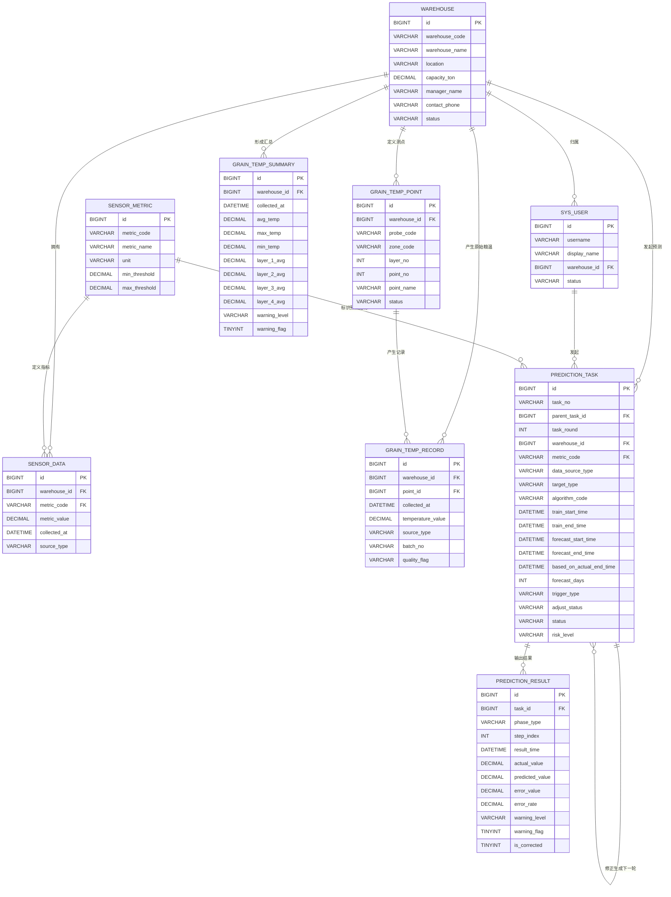
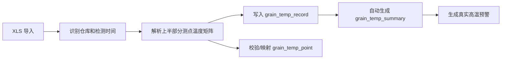

# 数据库设计（滚动预测与高温预警版）

## 1. 文档目的

本文档用于说明粮仓环境数据预测管理平台在“滚动预测、验证修正、高温预警、XLS 导入”新需求下的数据库设计方案。

本文档重点回答以下问题：

- 为什么要这样拆表
- 数据库中有哪些核心表
- 每张表的字段有什么作用
- 表与表之间如何联动
- 预测任务如何支持“验证 + 修正 + 再预测”
- 高温预警如何落到数据库中

## 2. 设计原则

## 2.1 原始真实数据与预测数据严格分离

这样设计的原因：

- 真实数据是事实，不应被预测结果污染
- 预测结果需要保留历史版本，不能覆盖真实数据
- 验证误差时，必须同时看到真实值和历史预测值

## 2.2 温度数据与普通环境数据分层建模

这样设计的原因：

- 温度来自固定报表中的多测点矩阵，结构复杂
- 湿度和二氧化碳当前仍是普通单值时序
- 如果把所有指标混在一张表里，会导致表结构臃肿、语义不清

## 2.3 修正预测不覆盖旧预测

这样设计的原因：

- 老师要求验证修正是否可行
- 如果旧预测被覆盖，就无法比较修正前后差异
- 保留版本后，可以展示误差变化和修正效果

## 2.4 预测输入以汇总数据为主，原始测点为基础

这样设计的原因：

- 原始测点数据必须保存，才能证明数据库设计完整
- 但直接对每个测点做预测，复杂度太高，不利于毕业设计落地
- 用汇总层温或整仓平均温度做预测，更适合答辩和系统实现

## 2.5 高温预警贯穿真实数据和预测数据

这样设计的原因：

- 系统不只是保存数据和做预测，还要输出风险判断
- 真实预警和预测预警都应可查、可展示、可追溯

## 3. 业务拆分

数据库按 5 个业务域组织：

1. 仓库域
2. 指标域
3. 普通环境数据域
4. 粮温数据域
5. 预测与预警域

## 4. 业务实体关系图（ER 图）

## 5. 表清单

| 表名 | 中文名称 | 作用 |
| --- | --- | --- |
| `warehouse` | 仓库表 | 保存仓库基础档案 |
| `sys_user` | 用户表 | 保存系统用户信息 |
| `sensor_metric` | 指标字典表 | 定义温度、湿度、二氧化碳等指标 |
| `sensor_data` | 普通环境数据表 | 保存湿度、二氧化碳等单值时序数据 |
| `grain_temp_point` | 粮温测点定义表 | 定义粮温测点位置 |
| `grain_temp_record` | 粮温原始记录表 | 保存每个测点在某次检测中的温度值 |
| `grain_temp_summary` | 粮温汇总分析表 | 保存层平均温度、整仓平均温度、最高温、最低温和真实预警 |
| `prediction_task` | 预测任务表 | 保存一轮预测任务的范围、来源、算法、轮次和状态 |
| `prediction_result` | 预测结果表 | 保存某轮任务下每日预测结果、真实值、误差和预测预警 |

## 6. 各表设计说明

## 6.1 `warehouse` 仓库表

设计原因：

- 所有环境数据、粮温数据和预测任务都必须有仓库归属
- 仓库是系统的核心主体对象

建议字段：

| 字段名 | 中文含义 | 作用 |
| --- | --- | --- |
| `id` | 主键ID | 唯一标识一条仓库记录 |
| `warehouse_code` | 仓库编号 | 业务唯一编号 |
| `warehouse_name` | 仓库名称 | 展示名称 |
| `location` | 仓库位置 | 记录仓库地址或区域 |
| `capacity_ton` | 仓容吨数 | 业务属性 |
| `manager_name` | 负责人姓名 | 便于管理 |
| `contact_phone` | 联系电话 | 联系方式 |
| `status` | 仓库状态 | 启用、停用等 |
| `grain_type` | 粮食品种 | 记录仓内粮食品类 |
| `remark` | 备注 | 补充说明 |

## 6.2 `sensor_metric` 指标字典表

设计原因：

- 统一管理环境指标定义
- 支撑阈值、单位和指标名称配置

建议字段：

| 字段名 | 中文含义 | 作用 |
| --- | --- | --- |
| `id` | 主键ID | 唯一标识 |
| `metric_code` | 指标编码 | 如 `temperature`、`humidity`、`co2` |
| `metric_name` | 指标名称 | 如温度、湿度、二氧化碳浓度 |
| `unit` | 单位 | 如 `°C`、`%`、`ppm` |
| `min_threshold` | 最小阈值 | 预警或显示参考 |
| `max_threshold` | 最大阈值 | 预警核心阈值 |
| `status` | 启用状态 | 是否启用 |

## 6.3 `sensor_data` 普通环境数据表

设计原因：

- 湿度和二氧化碳当前仍属于普通单值时序
- 不需要引入温度那套复杂测点结构

建议字段：

| 字段名 | 中文含义 | 作用 |
| --- | --- | --- |
| `id` | 主键ID | 唯一标识 |
| `warehouse_id` | 所属仓库ID | 关联仓库 |
| `metric_code` | 指标编码 | 区分湿度或二氧化碳 |
| `metric_value` | 指标值 | 实际数值 |
| `collected_at` | 采集时间 | 数据时间点 |
| `source_type` | 数据来源 | 手工、导入等 |
| `source_batch_no` | 批次号 | 对应导入批次 |
| `quality_flag` | 数据质量标记 | 标记异常、正常等 |
| `created_by` | 录入人 | 操作人 |
| `created_at` | 创建时间 | 记录产生时间 |

## 6.4 `grain_temp_point` 粮温测点定义表

设计原因：

- 粮温报表中的上半部分不是单一温度，而是大量测点矩阵
- 如果不先定义测点，原始记录会失去结构含义

建议字段：

| 字段名 | 中文含义 | 作用 |
| --- | --- | --- |
| `id` | 主键ID | 唯一标识测点 |
| `warehouse_id` | 所属仓库ID | 区分测点属于哪个仓库 |
| `probe_code` | 测温缆编号 | 标记测温缆或测温通道 |
| `zone_code` | 区域编号 | 如 A 区、B 区 |
| `layer_no` | 层号 | 如第 1 层、第 2 层 |
| `point_no` | 点位号 | 横向点位编号 |
| `point_name` | 测点名称 | 如 `A-1-8 测点` |
| `status` | 测点状态 | 是否启用 |
| `remark` | 备注 | 补充说明 |

## 6.5 `grain_temp_record` 粮温原始记录表

设计原因：

- 粮温原始测点值是系统最重要的真实数据基础
- 预测修正、误差追溯和汇总计算都依赖它

建议字段：

| 字段名 | 中文含义 | 作用 |
| --- | --- | --- |
| `id` | 主键ID | 唯一标识 |
| `warehouse_id` | 所属仓库ID | 关联仓库 |
| `point_id` | 测点ID | 关联测点定义 |
| `collected_at` | 检测时间 | 本次记录对应时间 |
| `temperature_value` | 温度值 | 实际测点温度 |
| `source_type` | 数据来源 | 导入、手工等 |
| `batch_no` | 导入批次号 | 对应本次导入 |
| `quality_flag` | 数据质量标记 | 标记正常或异常 |
| `created_by` | 录入人 | 操作人 |
| `created_at` | 创建时间 | 记录时间 |

## 6.6 `grain_temp_summary` 粮温汇总分析表

设计原因：

- 预测输入更适合使用汇总层温数据
- 页面展示和预警判断更适合用汇总结果
- 系统需要保存每次检测后的分析快照

建议字段：

| 字段名 | 中文含义 | 作用 |
| --- | --- | --- |
| `id` | 主键ID | 唯一标识 |
| `warehouse_id` | 所属仓库ID | 关联仓库 |
| `collected_at` | 检测时间 | 对应本次汇总的时间 |
| `avg_temp` | 整仓平均温度 | 预测和展示的核心值之一 |
| `max_temp` | 全仓最高温 | 预警参考 |
| `min_temp` | 全仓最低温 | 展示参考 |
| `layer_1_avg` | 第一层平均温度 | 层温分析 |
| `layer_2_avg` | 第二层平均温度 | 层温分析 |
| `layer_3_avg` | 第三层平均温度 | 层温分析 |
| `layer_4_avg` | 第四层平均温度 | 层温分析 |
| `warning_level` | 预警等级 | `NORMAL / ATTENTION / WARNING` |
| `warning_flag` | 是否预警 | 0 否，1 是 |
| `warning_message` | 预警说明 | 如“第二层平均温度偏高” |
| `analysis_result` | 分析结果 | 如“粮温正常” |
| `analysis_remark` | 分析备注 | 补充说明 |
| `created_at` | 创建时间 | 记录时间 |

## 6.7 `prediction_task` 预测任务表

设计原因：

- 一轮预测需要保留完整上下文
- 需要支持首次预测、修正预测和滚动续预测
- 需要记录训练窗口、预测窗口、轮次和版本关系

建议字段：

| 字段名 | 中文含义 | 作用 |
| --- | --- | --- |
| `id` | 主键ID | 唯一标识任务 |
| `task_no` | 预测任务编号 | 业务唯一编号 |
| `parent_task_id` | 父任务ID | 指向上一轮预测任务 |
| `task_round` | 预测轮次 | 表示第几轮预测 |
| `warehouse_id` | 所属仓库ID | 关联仓库 |
| `metric_code` | 预测指标编码 | 当前通常是 `temperature` |
| `data_source_type` | 数据来源类型 | 如 `GRAIN_TEMP_SUMMARY`、`SENSOR_DATA` |
| `target_type` | 预测目标类型 | 如 `AVG_TEMP`、`LAYER_1_AVG` |
| `algorithm_code` | 算法编码 | 如 `LINEAR_REGRESSION` |
| `algorithm_name` | 算法名称 | 中文展示名称 |
| `train_start_time` | 训练开始时间 | 训练参考区间开始 |
| `train_end_time` | 训练结束时间 | 训练参考区间结束 |
| `forecast_start_time` | 预测开始时间 | 本轮预测起始日期 |
| `forecast_end_time` | 预测结束时间 | 本轮预测截止日期 |
| `based_on_actual_end_time` | 已纳入真实数据截止时间 | 表示本轮任务使用真实数据到什么时候 |
| `forecast_days` | 预测天数 | 预测了多少天 |
| `sample_size` | 样本数 | 使用的真实样本数 |
| `trigger_type` | 触发类型 | `INITIAL / CORRECTION / ROLLING` |
| `adjust_status` | 修正状态 | `UNADJUSTED / ADJUSTED` |
| `status` | 任务状态 | 成功、失败、处理中 |
| `risk_level` | 风险等级 | 本轮整体风险等级 |
| `requested_by` | 发起人 | 谁发起的任务 |
| `requested_at` | 发起时间 | 任务开始时间 |
| `completed_at` | 完成时间 | 任务结束时间 |
| `summary` | 任务摘要 | 任务说明 |
| `remark` | 备注 | 补充信息 |

## 6.8 `prediction_result` 预测结果表

设计原因：

- 一轮预测通常会产生多天结果
- 需要保存每日预测值、真实值、误差和预警
- 需要支撑“验证 + 修正 + 再预测”闭环

建议字段：

| 字段名 | 中文含义 | 作用 |
| --- | --- | --- |
| `id` | 主键ID | 唯一标识结果 |
| `task_id` | 预测任务ID | 关联任务主表 |
| `phase_type` | 结果阶段类型 | `VERIFY` 或 `FUTURE` |
| `step_index` | 步序号 | 第几天预测结果 |
| `result_time` | 结果时间 | 对应哪一天 |
| `actual_value` | 真实值 | 后续回填的真实数据 |
| `predicted_value` | 预测值 | 系统预测结果 |
| `error_value` | 误差值 | 真实值与预测值的差 |
| `error_rate` | 误差率 | 误差百分比 |
| `warning_level` | 预警等级 | 预测预警结果 |
| `warning_flag` | 是否预警 | 0 否，1 是 |
| `warning_message` | 预警说明 | 如“预计 10 月上旬高温风险” |
| `is_corrected` | 是否已修正 | 是否属于修正后结果 |
| `remark` | 备注 | 补充说明 |
| `created_at` | 创建时间 | 结果落库时间 |

## 7. 表之间如何联动

## 7.1 粮温导入链路

联动说明：

- `grain_temp_point` 提供测点定义
- `grain_temp_record` 保存真实测点温度
- `grain_temp_summary` 由系统自动计算生成

## 7.2 首次预测链路

联动说明：

- 若预测温度，优先读取 `grain_temp_summary`
- 若预测湿度或二氧化碳，读取 `sensor_data`
- 任务上下文写入 `prediction_task`
- 每日预测结果写入 `prediction_result`

## 7.3 验证与修正链路

联动说明：

- 旧预测不删除
- 旧结果只补真实值和误差
- 修正后通过新任务和新结果保存
- `parent_task_id` 用于串起预测版本链

## 8. 为什么不用“一张大表全存”

不采用统一大表的原因：

- 原始真实数据、汇总数据、预测结果语义完全不同
- 修正预测会形成多版本，一张表难以表达
- 查询逻辑会变得很乱
- ER 图和答辩说明也会变差

因此本设计坚持：

- 原始测点数据单独表
- 汇总分析单独表
- 预测任务单独表
- 预测结果单独表

## 9. 索引建议

建议至少建立以下索引：

### 9.1 粮温原始记录

- `idx_grain_temp_record_query (warehouse_id, collected_at)`
- `idx_grain_temp_record_point_time (point_id, collected_at)`

用途：

- 支撑按仓库和时间查询原始粮温
- 支撑按测点追溯历史

### 9.2 粮温汇总分析

- `idx_grain_temp_summary_query (warehouse_id, collected_at)`

用途：

- 支撑按仓库和时间查询汇总趋势
- 支撑预测输入读取

### 9.3 预测任务

- `uk_prediction_task_no (task_no)`
- `idx_prediction_task_query (warehouse_id, metric_code, requested_at)`
- `idx_prediction_task_parent (parent_task_id)`

用途：

- 支撑任务历史查询
- 支撑修正任务链路查询

### 9.4 预测结果

- `uk_prediction_result_task_time (task_id, result_time)`
- `idx_prediction_result_time (result_time)`

用途：

- 支撑任务详情
- 支撑按日期回填真实值和误差

## 10. 预警设计说明

预警设计分为两类：

### 10.1 真实预警

来源：

- `grain_temp_summary`

作用：

- 判断某次真实检测是否存在高温风险

### 10.2 预测预警

来源：

- `prediction_result`

作用：

- 判断未来某一天是否可能存在高温风险

### 10.3 预警等级建议

- `NORMAL`：正常
- `ATTENTION`：接近阈值，需要关注
- `WARNING`：超过阈值，触发预警

## 11. 推荐的数据主线

正式主线建议如下：

1. 通过 XLS 导入原始测点温度数据
2. 自动生成 `grain_temp_summary`
3. 基于 `grain_temp_summary` 做温度滚动预测
4. 将预测任务写入 `prediction_task`
5. 将每日预测结果写入 `prediction_result`
6. 新真实数据到来后回填旧预测并计算误差
7. 生成下一轮修正任务和修正结果

这样设计兼顾了：

- 数据库完整性
- 实现难度可控
- 答辩展示清晰
- 后续扩展空间足够

## 12. 最终结论

本数据库设计的核心价值在于：

- 将复杂的粮温报表拆成可管理的数据结构
- 让真实数据、汇总数据、预测数据各归其位
- 支撑“训练参考 -> 未来预测 -> 真实值回填 -> 误差验证 -> 修正续预测”的滚动闭环
- 将高温预警同时落到真实数据和预测数据链路中

因此，这不是一个“只存预测结果”的简单数据库，而是一套能够支撑预测全过程追溯的数据库方案。
