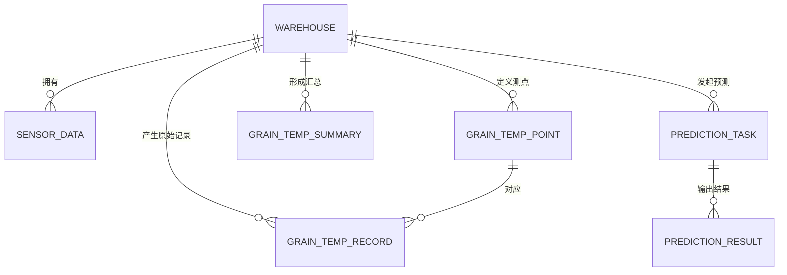
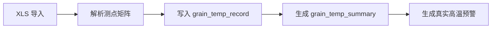

# 数据库设计（数据库优先 MVP 版）

## 1. 文档目的

本文档用于说明当前最新主线下的数据库设计方案。

当前口径与上一版相比的核心变化是：

- 本期重点从“验证修正闭环”进一步收口为“数据库、数据保存、管理、归档和展示”
- 修正链能力降级为扩展预留
- 本期不新增独立归档表

本文档重点回答：

- 本期数据库为什么这样拆表
- 哪些表是主线，哪些表是辅线
- 归档为什么不单独拆表
- 扩展字段如何保留而不强制实现修正入口

## 2. 设计原则

## 2.1 数据保存优先

数据库首先服务于“保存、管理、追溯”，而不是为了炫技式预测算法而设计。

因此本期优先保证：

- 原始数据能落库
- 汇总结果能落库
- 预测任务和预测结果能落库
- 数据可以按仓库、时间、指标进行查询和归档回看

## 2.2 真实数据与预测数据分离

这样设计的原因：

- 真实数据是事实来源
- 预测数据是系统生成结果
- 两者语义不同，不能混存
- 图表展示需要同时读取真实值和预测值

## 2.3 粮温与普通环境数据分层建模

这样设计的原因：

- 粮温来自测点矩阵，结构复杂
- 湿度、二氧化碳是简单单值时间序列
- 两者若强行统一，会让表结构臃肿且语义不清

## 2.4 归档直接建立在业务表之上

本期不新增独立 archive 表。

原因：

- `prediction_task + prediction_result` 已经具备归档能力
- 额外归档表会造成重复存储和一致性成本
- 对当前毕业设计来说收益不大

## 2.5 扩展字段保留，但不强制启用

本期虽然不做修正预测业务入口，但可以在表结构中保留以下扩展字段：

- `parent_task_id`
- `task_round`
- `trigger_type`
- `adjust_status`
- `is_corrected`
- `actual_value`
- `error_value`
- `error_rate`

作用：

- 兼容后续扩展
- 不影响当前主链实现
- 便于答辩时说明系统具备扩展空间

## 3. 业务域拆分

本期数据库按 5 个业务域组织：

1. 仓库域
2. 用户与权限域
3. 普通环境数据域
4. 粮温数据域
5. 预测与预警域

## 4. 核心表清单

| 表名 | 中文名称 | 本期定位 |
| --- | --- | --- |
| `warehouse` | 仓库表 | 主档表 |
| `sys_user` | 用户表 | 主档表 |
| `sys_role` | 角色表 | 主档表 |
| `sys_user_role` | 用户角色关联表 | 主档表 |
| `sensor_metric` | 指标字典表 | 基础配置表 |
| `sensor_data` | 普通环境数据表 | 湿度、二氧化碳辅线主表 |
| `grain_temp_point` | 粮温测点定义表 | 粮温主线基础表 |
| `grain_temp_record` | 粮温原始记录表 | 粮温主线真实数据表 |
| `grain_temp_summary` | 粮温汇总分析表 | 粮温主线展示与预测输入表 |
| `prediction_task` | 预测任务表 | 预测归档主表 |
| `prediction_result` | 预测结果表 | 预测归档明细表 |

## 5. 各表设计说明

## 5.1 `warehouse`

作用：

- 保存仓库基础档案
- 为粮温数据、普通环境数据和预测任务提供归属主体

关键字段建议：

- `warehouse_code`
- `warehouse_name`
- `location`
- `capacity_ton`
- `manager_name`
- `status`
- `grain_type`

## 5.2 `sensor_metric`

作用：

- 管理温度、湿度、二氧化碳等指标定义
- 统一单位和阈值配置

关键字段建议：

- `metric_code`
- `metric_name`
- `unit`
- `min_threshold`
- `max_threshold`

## 5.3 `sensor_data`

作用：

- 保存湿度和二氧化碳这类普通单值时序数据
- 支持文件导入和手工录入
- 支持趋势图查询

关键字段建议：

| 字段名 | 说明 |
| --- | --- |
| `warehouse_id` | 所属仓库 |
| `metric_code` | 指标编码 |
| `metric_value` | 指标值 |
| `collected_at` | 采集时间 |
| `source_type` | 数据来源 |
| `source_batch_no` | 导入批次 |
| `quality_flag` | 数据质量标记 |
| `created_by` | 操作人 |
| `created_at` | 创建时间 |

说明：

- 本期不把湿度、二氧化碳纳入复杂预测闭环
- 但保留其数据管理、图表展示和基础归档能力

## 5.4 `grain_temp_point`

作用：

- 定义粮温测点结构
- 说明每个原始温度值来自哪个层、哪个点位

关键字段建议：

- `warehouse_id`
- `probe_code`
- `zone_code`
- `layer_no`
- `point_no`
- `point_name`
- `status`

## 5.5 `grain_temp_record`

作用：

- 保存每次导入得到的原始测点温度
- 作为粮温真实数据的事实来源

关键字段建议：

| 字段名 | 说明 |
| --- | --- |
| `warehouse_id` | 所属仓库 |
| `point_id` | 测点 ID |
| `collected_at` | 检测时间 |
| `temperature_value` | 测点温度值 |
| `source_type` | 导入/手工 |
| `batch_no` | 导入批次号 |
| `quality_flag` | 数据质量标记 |
| `created_by` | 录入人 |
| `created_at` | 创建时间 |

唯一约束建议：

- `(point_id, collected_at)`

## 5.6 `grain_temp_summary`

作用：

- 保存系统自动计算的层温和整仓汇总结果
- 作为图表展示和预测输入的主来源
- 承担真实高温预警输出

关键字段建议：

| 字段名 | 说明 |
| --- | --- |
| `warehouse_id` | 所属仓库 |
| `collected_at` | 汇总时间 |
| `avg_temp` | 整仓平均温度 |
| `max_temp` | 最高温 |
| `min_temp` | 最低温 |
| `layer_1_avg` ~ `layer_4_avg` | 各层平均温度 |
| `warning_level` | 真实预警等级 |
| `warning_flag` | 是否预警 |
| `warning_message` | 预警说明 |
| `analysis_result` | 分析结果 |
| `analysis_remark` | 分析备注 |

唯一约束建议：

- `(warehouse_id, collected_at)`

## 5.7 `prediction_task`

作用：

- 保存一次预测请求的完整上下文
- 直接承担任务归档能力

本期核心字段：

| 字段名 | 说明 |
| --- | --- |
| `task_no` | 任务编号 |
| `warehouse_id` | 所属仓库 |
| `metric_code` | 预测指标 |
| `data_source_type` | 数据来源类型 |
| `target_type` | 预测目标 |
| `algorithm_code` | 算法编码 |
| `algorithm_name` | 算法名称 |
| `train_start_time` | 训练开始时间 |
| `train_end_time` | 训练结束时间 |
| `forecast_start_time` | 预测开始时间 |
| `forecast_end_time` | 预测结束时间 |
| `forecast_days` | 预测天数 |
| `sample_size` | 样本数 |
| `status` | 任务状态 |
| `risk_level` | 风险等级 |
| `requested_by` | 发起人 |
| `requested_at` | 发起时间 |
| `completed_at` | 完成时间 |
| `summary` | 任务摘要 |

本期保留但不强制启用的扩展字段：

- `parent_task_id`
- `task_round`
- `based_on_actual_end_time`
- `trigger_type`
- `adjust_status`

说明：

- 当前这些字段主要用于兼容未来扩展
- 本期业务入口默认走首次预测链

## 5.8 `prediction_result`

作用：

- 保存某轮预测任务下的每日预测结果
- 直接承担结果归档能力
- 支撑预测预警展示

本期核心字段：

| 字段名 | 说明 |
| --- | --- |
| `task_id` | 所属任务 |
| `phase_type` | 结果阶段类型 |
| `step_index` | 第几天 |
| `result_time` | 结果时间 |
| `predicted_value` | 预测值 |
| `warning_level` | 预测预警等级 |
| `warning_flag` | 是否预警 |
| `warning_message` | 预警说明 |
| `created_at` | 落库时间 |

本期保留但不强制启用的扩展字段：

- `actual_value`
- `error_value`
- `error_rate`
- `is_corrected`
- `remark`

唯一约束建议：

- `(task_id, result_time)`

## 6. 实体关系说明

本期说明：

- `prediction_task -> prediction_task` 的父子链路保留扩展能力，但不是当前主流程重点

## 7. 本期核心数据链路

## 7.1 粮温导入链路

## 7.2 普通环境数据链路

## 7.3 预测与归档链路

## 8. 为什么本期不拆独立归档表

当前归档需求主要是：

- 查看历史任务
- 查看任务明细
- 回看预测结果
- 做图表与答辩展示

`prediction_task + prediction_result` 已经天然覆盖这些需求。

如果此时再新增 `prediction_archive` 一类表，会带来：

1. 数据冗余
2. 同步复杂
3. 一致性问题
4. 不必要的实现成本

因此本期坚持：

- 任务级归档 = `prediction_task`
- 结果级归档 = `prediction_result`

## 9. 索引建议

### 9.1 `sensor_data`

- `idx_sensor_query (warehouse_id, metric_code, collected_at)`

### 9.2 `grain_temp_record`

- `idx_grain_temp_record_query (warehouse_id, collected_at)`
- `idx_grain_temp_record_point_time (point_id, collected_at)`

### 9.3 `grain_temp_summary`

- `idx_grain_temp_summary_query (warehouse_id, collected_at)`

### 9.4 `prediction_task`

- `uk_prediction_task_no (task_no)`
- `idx_prediction_task_query (warehouse_id, metric_code, requested_at)`
- `idx_prediction_task_parent (parent_task_id)`

### 9.5 `prediction_result`

- `uk_prediction_result_task_time (task_id, result_time)`
- `idx_prediction_result_time (result_time)`

## 10. 预警设计

预警分两类：

### 10.1 真实预警

来源：

- `grain_temp_summary`

用途：

- 判断当前真实粮温是否存在高温风险

### 10.2 预测预警

来源：

- `prediction_result`

用途：

- 判断未来某一天是否存在高温风险

### 10.3 预警等级建议

- `NORMAL`
- `ATTENTION`
- `WARNING`

## 11. 本期推荐主线

1. 导入粮温测点真实数据
2. 生成粮温汇总分析结果
3. 导入或录入湿度、二氧化碳数据
4. 基于粮温汇总创建预测任务
5. 将预测任务和结果直接作为归档保存
6. 页面展示实际值 / 预测值双线图
7. 展示真实预警与预测预警

## 12. 最终结论

当前数据库设计的核心价值不在于“修正链做得多完整”，而在于：

- 原始数据结构是否清晰
- 数据是否能够长期保存
- 查询与管理是否方便
- 预测结果是否能直接归档
- 实际值与预测值是否能支撑页面展示

因此，本期数据库最合理的设计方向是：

**粮温主线深建模、普通环境数据轻建模、预测归档两层表、不拆独立 archive 表、保留扩展字段但不强制启用。**
