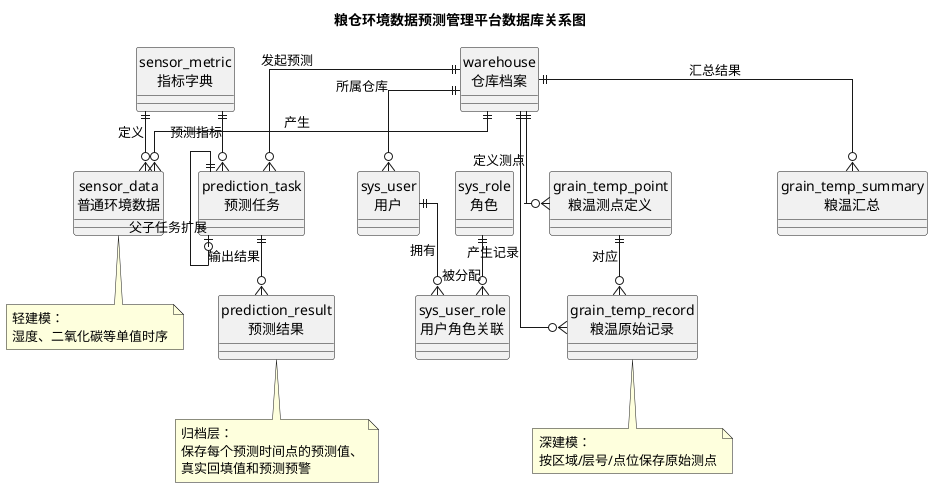
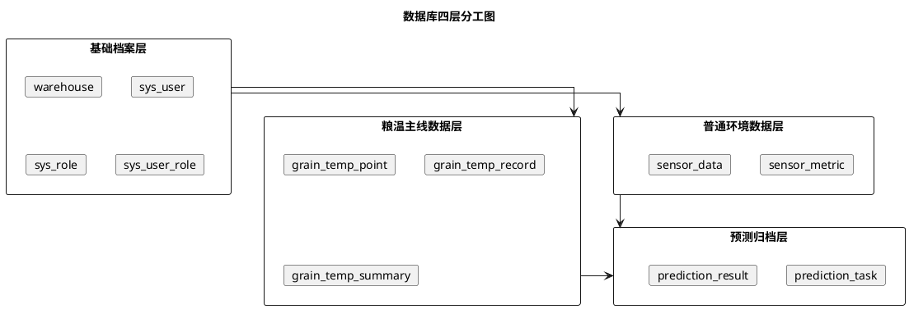
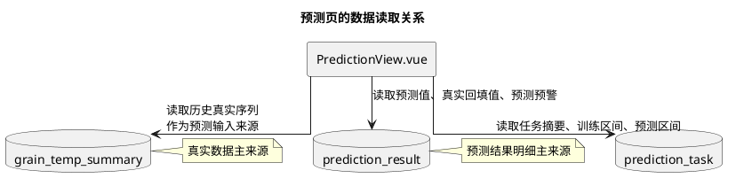
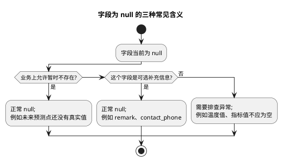

# 数据库设计与表字段初学者说明

## 1. 文档目的

这份文档是写给“想真正看懂数据库为什么这样设计的人”的。

它重点回答下面这些问题：

- 为什么这个项目不是一张大表全塞完
- 为什么粮温数据和湿度/二氧化碳要分开设计
- 每张表负责什么
- 表和表之间怎么关联
- 哪些字段可以为 `null`
- 这些 `null` 到底表示“没填”、还是“暂时不存在”、还是“业务上就允许为空”

配套数据库关系图见：

- `zzz-docs/设计文档/数据库设计与表字段初学者说明-关系图.puml`

为了便于直接阅读，下面也把关系图直接插在文档里：

## 2. 先记住一句话：数据库是这个项目的真相源

本项目叫“数据库优先 MVP”，不是随便起的口号。

它的意思是：

- 页面只是展示层
- 后端只是业务处理层
- 数据库才是事实最终保存的地方

所以数据库设计的目标不是“看起来复杂”，而是：

- 真实数据能留住
- 关系清楚
- 查询方便
- 预测任务能归档
- 后续能扩展

## 3. 为什么不把所有数据都塞进一张表

初学者最常见的想法是：既然都是粮仓环境数据，为什么不来一张总表？

原因很简单：**不同数据的结构完全不同。**

### 3.1 普通环境数据是“单值时序”

例如：

- 湿度
- 二氧化碳浓度

它们的共同点是：

- 一次采集就一个值
- 不需要分层号、点位号

所以这类数据可以用一张比较轻的表：

- `sensor_data`

### 3.2 粮温数据是“测点矩阵”

粮温不是“一次采集一个值”，而是：

- 一个仓库
- 一个区域
- 一根测温缆
- 多个层号
- 多个点位
- 每个点位一个温度

所以粮温必须拆成三层：

1. `grain_temp_point`
   - 定义测点结构
2. `grain_temp_record`
   - 保存原始测点值
3. `grain_temp_summary`
   - 保存系统汇总结果

这就是“深建模”的意思。

### 3.3 预测数据也不能和真实数据混在一起

预测数据和真实数据语义不同：

- 真实数据代表“已经发生的事实”
- 预测数据代表“系统对未来的推算”

所以预测必须单独设计：

- `prediction_task`
- `prediction_result`

这样才能明确区分：

- 这次是谁发起的预测
- 用了什么训练区间
- 预测了多少天
- 每一天的预测值是多少

## 4. 数据库按业务可以分成哪几块

当前数据库可以分成四个层次来理解。

### 4.1 基础档案层

包括：

- `warehouse`
- `sys_user`
- `sys_role`
- `sys_user_role`

作用：

- 定义仓库、用户、角色
- 给后续所有业务表提供归属关系和权限关系

### 4.2 普通环境数据层

包括：

- `sensor_metric`
- `sensor_data`

作用：

- 管理湿度、二氧化碳等单值指标

### 4.3 粮温主线数据层

包括：

- `grain_temp_point`
- `grain_temp_record`
- `grain_temp_summary`

作用：

- 保存粮温的结构、原始记录和汇总结果

### 4.4 预测归档层

包括：

- `prediction_task`
- `prediction_result`

作用：

- 保存每次预测的上下文和结果明细

把这四层放在一起，可以更直观看成下面这个分层图：

## 5. 每张表分别是干什么的

## 5.1 `warehouse`

这是一张仓库主档表。

它保存的是：

- 仓库编号
- 仓库名称
- 位置
- 容量
- 负责人
- 仓库状态
- 粮食品类

为什么必须有它：

- 所有环境数据、粮温记录、预测任务都要知道“自己属于哪个仓”
- 用户权限也可能和仓库绑定

### 哪些字段可以为 `null`

- `contact_phone`
  - 允许为空
  - 含义：当前没有录入联系电话，不影响仓库存在
- `grain_type`
  - 允许为空
  - 含义：暂时没有明确主要粮种，或者演示时不强调这一项
- `remark`
  - 允许为空
  - 含义：没有额外说明

## 5.2 `sys_user`

这是一张用户表。

它保存：

- 登录用户名
- 密码
- 展示名称
- 手机号
- 所属仓库
- 状态
- 最后登录时间

### 为什么 `warehouse_id` 可以为 `null`

因为并不是所有用户都属于某一个具体仓库。

例如：

- 平台管理员
- 全局查看者

这类账号可以管理或查看全局，所以：

- `warehouse_id = null`

表示：

**这是平台级账号，不绑定单一仓库。**

### 其他可为 `null` 的字段

- `phone`
  - 没填手机号
- `last_login_at`
  - 还从未登录过

## 5.3 `sys_role` 和 `sys_user_role`

这两张表一起看更容易理解。

### `sys_role`

保存角色定义，例如：

- `ADMIN`
- `WAREHOUSE_MANAGER`
- `VIEWER`

### `sys_user_role`

保存“哪个用户拥有哪些角色”。

为什么不直接在 `sys_user` 里放一个 `role_code` 字段？

因为项目允许一个用户有多个角色。  
例如以后完全可以扩展成：

- 既是仓库管理员，又有某些查看权限

所以这里用“用户表 + 角色表 + 关联表”的经典设计。

## 5.4 `sensor_metric`

这是一张指标字典表。

它保存：

- 指标编码
- 指标名称
- 单位
- 阈值
- 状态

为什么需要它，而不是把“温度/湿度/二氧化碳”写死在代码里？

因为这样更统一：

- 前端下拉选项可直接读取
- 后端阈值判断可直接读取
- 以后新增指标更方便

### 哪些字段可以为 `null`

- `min_threshold`
- `max_threshold`

允许为空的原因：

- 有些指标当前只关心上限，不关心下限
- 有些指标暂时还没定义阈值

所以这里的 `null` 表示：

**该指标当前没有配置这一侧阈值，不代表数据错误。**

## 5.5 `sensor_data`

这张表保存普通环境数据，也就是湿度和二氧化碳这类单值时序。

核心字段：

- `warehouse_id`
- `metric_code`
- `metric_value`
- `collected_at`

辅助字段：

- `source_type`
- `source_batch_no`
- `quality_flag`
- `remark`
- `created_by`

### 为什么 `source_batch_no` 可以为 `null`

因为不是所有数据都来自批量导入。

- 如果是手工录入，通常没有批次号
- 如果是文件导入，就会有批次号

所以：

- `source_batch_no = null`

表示：

**这条数据不是某次文件导入批次产生的。**

### 为什么 `created_by` 可以为 `null`

理论上大多数系统数据都有操作人，但这里保留 `null` 是为了兼容：

- 旧演示数据
- 脚本初始化数据
- 未来可能存在的系统自动灌库

## 5.6 `grain_temp_point`

这是粮温测点定义表。

它不保存温度值，只保存“测点长什么样”。

主要字段：

- `warehouse_id`
- `probe_code`
- `zone_code`
- `layer_no`
- `point_no`
- `point_name`

为什么要单独建这张表：

- 一个测点会被重复采集很多次
- 如果每条温度记录都重复存“区域/层号/点位”的全套结构，冗余会很大

所以做法是：

- 先定义测点
- 再让原始记录引用测点 ID

### 为什么 `remark` 可以为 `null`

因为大多数测点不需要特别备注，只有少数点位需要说明。

## 5.7 `grain_temp_record`

这是粮温原始记录表。

它保存的是：

- 某个测点
- 某个时间
- 采到的真实温度

你可以把它理解成：

**粮温的“事实层”**。

### 为什么既有 `warehouse_id` 又有 `point_id`

初学者常问：既然 `point_id` 已经能找到仓库，为什么还保留 `warehouse_id`？

原因是查询效率和业务便利性。

- 按仓库查记录是高频操作
- 直接保留 `warehouse_id` 更方便做索引和筛选

### 为什么 `batch_no` 可以为 `null`

和普通环境数据同理：

- 文件导入有批次号
- 手工录入没有批次号

### 为什么 `created_by` 可以为 `null`

原因也类似：

- 早期演示数据或脚本数据可能不是某个真实用户录入

## 5.8 `grain_temp_summary`

这是粮温汇总表。

它不是人工填写的，而是系统根据原始测点记录自动计算出来的。

它保存：

- 整仓均温
- 最高温
- 最低温
- 各层均温
- 预警等级
- 预警说明
- 分析结果

为什么一定要有汇总表，而不是每次页面临时算？

因为：

- 首页要用
- 数据页要用
- 预测页也要用
- 预警也要用

如果每次都从原始测点临时算：

- 查询会更重
- 代码更复杂
- 页面和页面之间容易出现不同口径

### 为什么 `layer_1_avg` 到 `layer_4_avg` 可以为 `null`

因为理论上某个时间点可能出现：

- 某一层还没有完整测点
- 某个仓库未来层数结构不同
- 某层数据被清理掉

这时：

- 某层均温不存在
- 但整条汇总记录仍然有意义

所以这里的 `null` 表示：

**这一层当前没有可用于计算的完整均温。**

### 为什么 `warning_message` 可以为 `null`

因为：

- 正常状态下不一定需要提示文字

于是：

- `warning_flag = 0`
- `warning_message = null`

是非常合理的组合。

## 5.9 `prediction_task`

这是预测任务主表。

它保存的是“一次预测请求”的上下文，而不是每个预测点。

主要内容包括：

- 哪个仓库
- 预测哪个指标
- 预测哪个目标
- 用什么算法
- 训练区间是什么
- 预测区间是什么
- 预测几天
- 谁发起的
- 风险等级是什么

为什么必须单独有主表：

- 一次预测会产生多条结果
- 主表更适合保存任务级信息

### 为什么这些字段可以为 `null`

- `parent_task_id`
  - 当前很多任务都是首轮预测，没有父任务
  - `null` 表示当前任务不是从上一轮修正任务延续来的
- `based_on_actual_end_time`
  - 某些旧任务或特殊任务可能还没明确记录这个边界
  - `null` 表示没有额外补充这项信息
- `requested_by`
  - 如果是初始化演示数据或系统脚本生成，可能不对应真实登录用户
- `completed_at`
  - 理论上未完成任务可以为空
  - 当前大部分演示任务是成功完成的，所以通常有值
- `summary`
  - 没写摘要时允许为空
- `remark`
  - 没额外备注时允许为空

## 5.10 `prediction_result`

这是预测结果明细表。

它保存的是：

- 某个任务下
- 某个时间点
- 预测值是多少
- 是否有真实值回填
- 误差是多少
- 是否触发预测预警

### 为什么 `actual_value` 可以为 `null`

这是最关键的 `null` 之一。

它的含义不是“坏数据”，而是：

**这个预测时间点对应的真实值现在还没有录入。**

比如：

- 4 月 25 日做了未来 10 天预测
- 预测结果里有 4 月 28 日、4 月 29 日、5 月 1 日
- 如果真实粮温还没录到这些时间点，那么 `actual_value` 就应该为空

### 为什么 `error_value` 和 `error_rate` 可以为 `null`

因为误差必须建立在“真实值已存在”的前提下。

没有真实值，就没法算误差。

所以：

- `actual_value = null`
- `error_value = null`
- `error_rate = null`

是一组正常状态。

### 为什么 `warning_message` 可以为 `null`

原因和真实预警一样：

- 预测值正常时，不一定需要额外说明

### 为什么 `is_corrected` 默认是 0

因为当前主线没有强制做“修正预测入口”，所以大部分结果都是普通预测结果。

这里保留字段，是为了以后扩展，不代表当前一定启用。

## 6. 表和表之间到底怎么配合

这里给一个最常见的理解方式。

### 6.1 用户和仓库

- 一个用户可以属于一个仓库，也可以不属于具体仓库
- 一个仓库可以有多个用户

### 6.2 仓库和环境数据

- 一个仓库可以有很多条普通环境数据
- 一个仓库也可以有很多粮温测点、原始记录和汇总结果

### 6.3 预测任务和预测结果

- 一个预测任务对应多条预测结果

这就是典型的：

- 主表：`prediction_task`
- 明细表：`prediction_result`

## 7. 页面常见查询到底查了哪些表

### 7.1 仪表盘

主要会查：

- `warehouse`
- `grain_temp_summary`
- `prediction_result`
- `prediction_task`

目的：

- 统计仓库数
- 统计真实预警数
- 统计预测预警数
- 统计预测归档数
- 展示最新汇总和仓库健康度

### 7.2 环境数据页

普通环境模式主要查：

- `sensor_data`
- `sensor_metric`

粮温模式主要查：

- `grain_temp_record`
- `grain_temp_summary`
- `grain_temp_point`

### 7.3 预测页

主要查：

- `grain_temp_summary`
- `prediction_task`
- `prediction_result`

目的：

- 先拿历史真实序列做预测
- 再拿预测任务和预测结果回显到页面

这一块最容易混淆，建议配合下面这张图一起理解：

## 8. 为什么现在这样设计，而不是别的设计

### 8.1 为什么不单独再建 archive 表

因为当前：

- `prediction_task` 已经能表达任务级归档
- `prediction_result` 已经能表达结果级归档

再建 archive 表只会带来：

- 冗余
- 数据同步成本
- 更复杂的代码

### 8.2 为什么不让预测页直接读取 `grain_temp_record`

因为原始测点记录太细，直接拿来做预测会让预测层承担额外聚合成本。

当前更合理的方式是：

- 先通过 `grain_temp_summary` 收口成统一的历史序列
- 再把这个序列交给预测服务

### 8.3 为什么保留一些“当前没完全用上的字段”

例如：

- `parent_task_id`
- `task_round`
- `adjust_status`
- `is_corrected`

原因是：

- 当前不做完整修正链入口
- 但数据库结构保留扩展可能

这是一种常见的工程折中：**先保证当前主线可用，同时不给未来扩展完全堵死。**

## 9. 初学者怎么判断一个字段的 `null` 是正常还是异常

一个简单方法是问自己一句话：

**“这个字段为空，是不是业务上本来就允许这个信息暂时不存在？”**

如果答案是“允许”，那这个 `null` 就是正常的。  
例如：

- 用户还没登录过，所以 `last_login_at = null`
- 预测结果未来时点还没有真实值，所以 `actual_value = null`
- 平台管理员不属于具体仓库，所以 `warehouse_id = null`

如果答案是“不应该”，那就要怀疑是不是异常。  
例如：

- `grain_temp_record.temperature_value = null`
- `sensor_data.metric_value = null`

这些就不合理，因为核心事实值不能为空。

也可以把“允许为 null 的原因”简单分成下面三类：

## 10. 总结

这个数据库设计的核心思路可以概括成三句话：

1. **基础档案单独建，保证归属和权限清楚**
2. **普通环境轻建模，粮温主线深建模**
3. **预测任务和预测结果分层归档，不和真实数据混表**

所以它不是“表越多越好”，而是：

- 哪些数据结构简单，就轻一点
- 哪些数据结构复杂，就深一点
- 哪些数据语义不同，就拆开

这样设计出来的数据库，才既适合当前毕业设计展示，也适合后续继续扩展。
