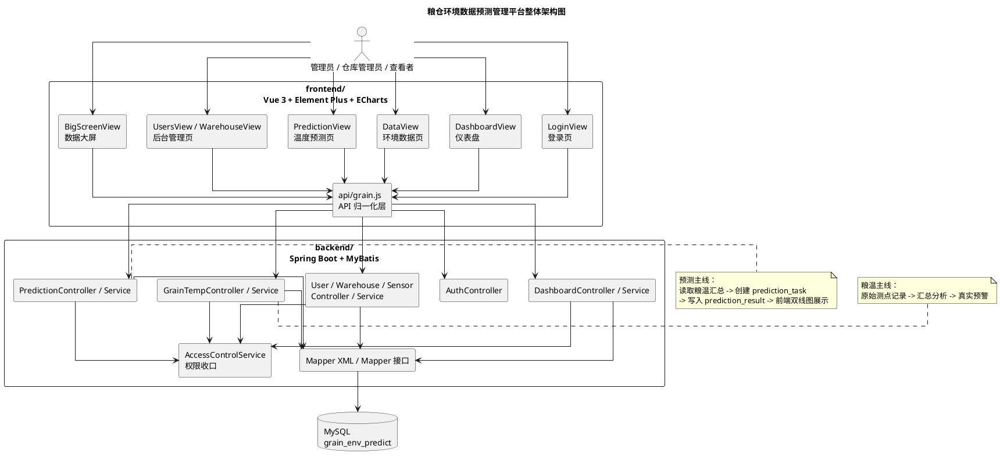
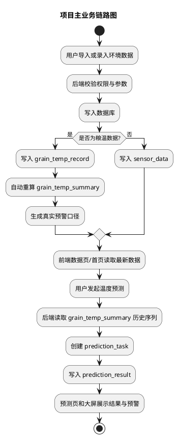
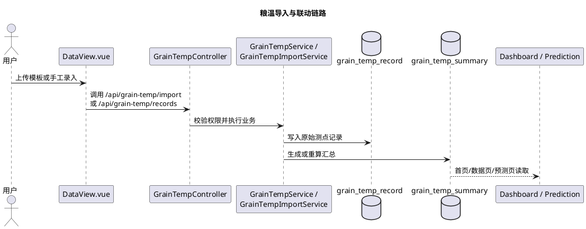
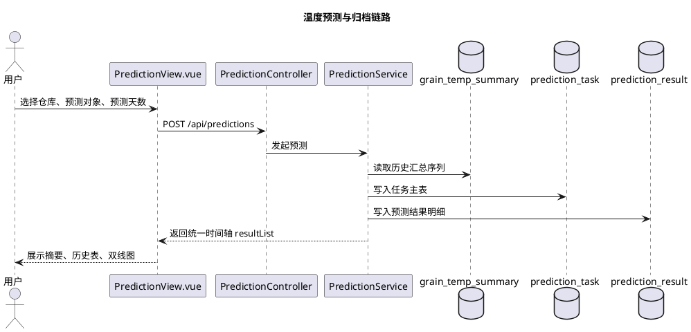

# 项目整体架构与前后端初学者说明

## 1. 文档目的

这份文档不是写给“已经很熟项目的人”的，而是写给下面这些场景：

- 第一次接手这个毕业设计项目
- 需要快速理解前后端为什么这样拆
- 需要向老师、同学或后续维护者解释这个项目是怎么写出来的
- 想先看懂整体结构，再去读具体代码

如果只看一句话，这个项目可以概括为：

**它是一个以数据库留痕为核心的粮仓环境数据预测管理平台，重点不是做复杂算法，而是把“数据导入、数据管理、汇总分析、温度预测、结果归档、图表展示、预警提示”这条链路完整跑通。**

配套架构图见：

- `zzz-docs/设计文档/项目整体架构与前后端初学者说明-架构图.puml`

为了便于直接阅读，下面也把架构图直接插在文档里：

## 2. 这个项目到底是干什么的

项目面对的是“粮仓环境管理”这个业务场景。老师和课题要求里最核心的事情，不是做一个花哨的大模型，而是做一个**能把粮仓环境数据规范保存、管理、查询、预测和展示出来的平台**。

系统当前主线是：

1. 用户导入或录入粮仓环境数据
2. 数据写入数据库
3. 粮温数据自动生成汇总结果
4. 用户基于历史粮温汇总发起短期预测
5. 预测结果归档到数据库
6. 首页、预测页和大屏把真实数据、预测数据和预警展示出来

这条主线为什么重要：

- 它符合任务书和开题报告对“平台完整性”的要求
- 它能支撑答辩展示，因为每一步都有数据库留痕
- 它便于后续继续扩展，比如以后要做更复杂算法、修正预测、接硬件数据，都有基础

## 3. 为什么采用前后端分离

本项目采用的是典型的前后端分离结构：

- 前端在 `frontend/`
- 后端在 `backend/`
- 数据库存储在 MySQL

这样拆分有几个好处：

### 3.1 前端专注“展示和交互”

前端负责：

- 页面布局
- 表单录入
- 列表分页
- 图表展示
- 按钮交互和提示信息

前端不负责：

- 直接访问数据库
- 计算汇总结果
- 判断是否有写权限
- 决定真实的业务规则

### 3.2 后端专注“业务规则和数据处理”

后端负责：

- 校验当前用户是谁
- 校验当前用户有没有权限操作某个仓库
- 接收前端参数
- 查询和写入数据库
- 生成粮温汇总
- 创建预测任务与预测结果
- 把数据库里的多张表整合成前端真正需要的数据结构

### 3.3 数据库专注“保存真实状态”

数据库负责：

- 保存仓库、用户、角色等基础数据
- 保存湿度、二氧化碳、粮温原始记录
- 保存粮温汇总
- 保存预测任务和预测结果

这也是“数据库优先 MVP”这句话的真正含义：**先把数据留住、关系建清楚、查询跑通，再谈更复杂的功能。**

如果你想先看整体流转，而不是先看目录结构，可以先看下面这张主业务链路图：

## 4. 前端框架是怎么用的

前端当前技术栈主要是：

- `Vue 3`：负责页面组件和响应式状态
- `Vue Router`：负责页面路由
- `Element Plus`：负责表单、表格、分页、弹窗等 UI 组件
- `ECharts`：负责折线图和趋势图

### 4.1 路由层在干什么

入口文件是：

- `frontend/src/router/index.js`

这里做了三件事：

1. 注册所有页面
2. 给页面写 `meta`，包括标题、描述、可访问角色、导航顺序
3. 用路由守卫控制：
   - 是否登录
   - 当前角色默认跳到哪个首页
   - 是否有权访问某个页面

所以，**路由文件不只是“跳页面”，它还是页面权限和菜单结构的入口。**

### 4.2 布局层在干什么

布局文件是：

- `frontend/src/layout/ConsoleLayout.vue`

它负责：

- 左侧菜单
- 顶部标题
- 当前用户显示
- “数据大屏”快捷入口
- 主体区域的页面切换

可以把它理解成“后台管理端的外壳”，真正的业务页面都渲染在这个外壳里面。

### 4.3 API 层为什么单独写一层

API 层主要在：

- `frontend/src/api/grain.js`

很多初学者会问：为什么前端不直接 `axios.get()` 后就把数据塞给页面？

原因是后端返回的数据结构不一定完全稳定，页面真正需要的数据结构也不一定和后端一模一样。于是 API 层承担两个职责：

1. **调用接口**
2. **做数据归一化**

例如：

- 把分页结果统一收口成 `list / pageNum / pageSize / total`
- 把预测任务统一收口成页面可直接渲染的 `resultList`
- 把首页概览接口中可能缺失的字段做兜底

这样做的好处是：

- 页面更简单
- 后端轻微改动时，通常只需要改 API 层
- 多个页面可以复用同一套数据结构

## 5. 每个前端页面是干什么的

### 5.1 登录页

页面：

- `frontend/src/views/LoginView.vue`

作用：

- 输入用户名和密码
- 建立当前会话
- 把当前用户角色带到前端状态里

为什么需要它：

- 没有登录页，后端就不知道当前是谁
- 没有当前用户，仓库权限就没法做

### 5.2 仪表盘

页面：

- `frontend/src/views/DashboardView.vue`

作用：

- 看平台整体概况
- 看真实预警和预测预警
- 看最新粮温汇总
- 看仓库健康度

为什么这个页面存在：

- 它是“老师打开系统第一眼看到什么”的页面
- 适合快速解释平台已经不是单纯数据录入工具，而是有监控和分析能力

### 5.3 环境数据页

页面：

- `frontend/src/views/DataView.vue`

这是整个系统里最容易让初学者迷糊，但实际上非常关键的页面。

它分成两条数据主线：

1. **粮温主线**
   - 维护粮温原始测点记录
   - 查看粮温汇总趋势
   - 查看汇总表和原始记录表
2. **普通环境主线**
   - 维护湿度、二氧化碳等单值数据
   - 查看这些指标的趋势图和记录表

为什么要把两条主线放一个页面：

- 它们都属于“环境数据管理”
- 但数据结构复杂度不同
- 粮温是深建模，湿度/二氧化碳是轻建模

所以这个页面既展示了“统一入口”，也保留了“不同数据类型不同处理方式”。

### 5.4 温度预测页

页面：

- `frontend/src/views/PredictionView.vue`

作用：

- 选择仓库、预测对象、预测天数
- 发起温度预测
- 查看任务摘要
- 查看实际值 / 预测值双线图
- 查看预测历史归档

为什么这个页面是项目亮点：

- 它把“分析”这件事真正做出来了
- 不是只显示静态图，而是从数据库里拿历史汇总做预测，再把结果归档回数据库
- 当前还支持“历史任务详情回填后来录入的真实值”，这对答辩解释非常有帮助

### 5.5 用户管理页

页面：

- `frontend/src/views/UsersView.vue`

作用：

- 新增、编辑、删除用户
- 分配角色
- 重置密码

为什么存在：

- 系统不能只展示数据，还要体现“平台管理能力”
- 用户、角色、权限是一个完整系统的基础

### 5.6 仓库管理页

页面：

- `frontend/src/views/WarehouseView.vue`

作用：

- 管理仓库档案
- 查看仓库状态
- 为后续数据归属和权限归属提供主体

为什么存在：

- 所有环境数据、粮温数据和预测任务都必须归属于某个仓库
- 没有仓库主档，后续数据关系会很混乱

### 5.7 数据大屏

页面：

- `frontend/src/views/BigScreenView.vue`

作用：

- 用更适合展示的样式把仪表盘核心信息重新组织出来

为什么存在：

- 便于课堂演示和答辩展示
- 不影响后台管理逻辑

## 6. 后端框架是怎么用的

后端当前技术栈主要是：

- `Spring Boot`：做 Web 应用和接口入口
- `MyBatis`：做数据库查询与持久化
- `MySQL`：做业务数据存储

### 6.1 Controller、Service、Mapper 为什么分层

这是后端最重要的结构。

#### Controller 层

例如：

- `PredictionController`
- `GrainTempController`
- `DashboardController`

职责：

- 接收前端请求
- 读取参数
- 返回统一接口格式
- 调用权限校验
- 调用 Service

可以把它理解成“接口门口的接待员”。

#### Service 层

例如：

- `PredictionService`
- `GrainTempService`
- `DashboardService`

职责：

- 编排业务逻辑
- 决定先查什么、再算什么、最后返回什么
- 把多张表的数据整合成业务结果

可以把它理解成“真正做事的人”。

#### Mapper 层

例如：

- `PredictionTaskMapper`
- `GrainTempSummaryMapper`
- `DashboardMapper`

职责：

- 直接和数据库打交道
- 执行 SQL
- 把查询结果映射成 Java 对象

可以把它理解成“数据库翻译层”。

### 6.2 权限为什么单独收口

关键文件：

- `backend/src/main/java/com/grain/platform/security/AccessControlService.java`

它负责两件大事：

1. 判断当前用户是谁
2. 判断当前用户能看哪个仓、能不能改哪个仓

这样做的好处是：

- 权限逻辑不会散落在每个 Controller 里
- 管理员、仓库管理员、查看者的规则都能统一维护

## 7. 一条典型业务链路是怎么跑通的

### 7.1 粮温导入链路

链路是：

1. 前端在 `DataView.vue` 上传文件
2. 前端通过 `api/grain.js` 调 `POST /api/grain-temp/import`
3. `GrainTempController` 接收文件
4. `GrainTempService` / `GrainTempImportService` 解析模板
5. 写入 `grain_temp_record`
6. 自动生成或重算 `grain_temp_summary`
7. 首页、数据页和预测页都能读取到最新结果

对应关系可以用这张图理解：

为什么这样设计：

- 原始测点记录必须保留
- 汇总结果不能靠前端临时算
- 后续预测应该基于汇总表，而不是每次都重扫所有测点

### 7.2 温度预测链路

链路是：

1. 前端在 `PredictionView.vue` 选择仓库、预测对象、预测天数
2. 调用 `POST /api/predictions`
3. `PredictionService` 读取历史真实序列
4. `ForecastService` 生成未来预测值
5. 写入 `prediction_task`
6. 写入 `prediction_result`
7. 再把真实值与预测值合并成统一时间轴返回前端
8. 前端渲染任务摘要、预测历史表和双线图

对应关系可以用这张图理解：

为什么要拆成 `prediction_task + prediction_result` 两张表：

- 一次预测任务会产生多条未来时间点结果
- 如果全塞一张表，任务信息和结果信息会很混乱
- 双表设计更符合“主表 + 明细表”的建模习惯

## 8. 为什么项目现在这样写，而不是别的写法

### 8.1 为什么不用前端直接算图表和预警

因为：

- 前端只适合展示，不适合承担真业务口径
- 汇总、预警和预测都属于“后端真相”
- 如果前端自己算，页面一多就会出现口径不一致

### 8.2 为什么预测算法不做得更复杂

因为本项目当前目标不是算法竞赛，而是毕业设计平台实现。

重点是：

- 数据能不能规范落库
- 结果能不能归档
- 页面能不能演示
- 业务链路能不能讲清楚

所以当前算法采用简单回归或移动平均思路，是为了让整个平台更稳、更可解释。

### 8.3 为什么 `frontend-next/` 没作为正式前端

因为当前正式前端已经确定在：

- `frontend/`

而：

- `frontend-next/`

只保留作静态原型参考，不再作为当前真实业务代码入口。

## 9. 初学者推荐阅读顺序

如果你准备从头理解这个项目，建议按这个顺序看：

1. 先看本篇文档，理解项目目标和结构
2. 再看 `frontend/src/router/index.js`
3. 再看 `frontend/src/api/grain.js`
4. 再看 `frontend/src/views/DataView.vue`
5. 再看 `frontend/src/views/PredictionView.vue`
6. 再看 `backend/src/main/java/com/grain/platform/service/GrainTempService.java`
7. 再看 `backend/src/main/java/com/grain/platform/service/PredictionService.java`
8. 最后再去看数据库文档

这样读会比“直接从某个 800 行页面开始硬看”容易很多。

## 10. 总结

这个项目的重点不是某一个页面特别复杂，也不是某一个算法特别高级，而是：

- 页面职责清楚
- 前后端边界清楚
- 数据主线完整
- 数据库留痕完整
- 预测结果可归档、可展示、可回看

从工程角度看，它更像一个“围绕粮仓环境业务构建的小型管理平台”，而不是“只做一张预测图的课程作业”。
